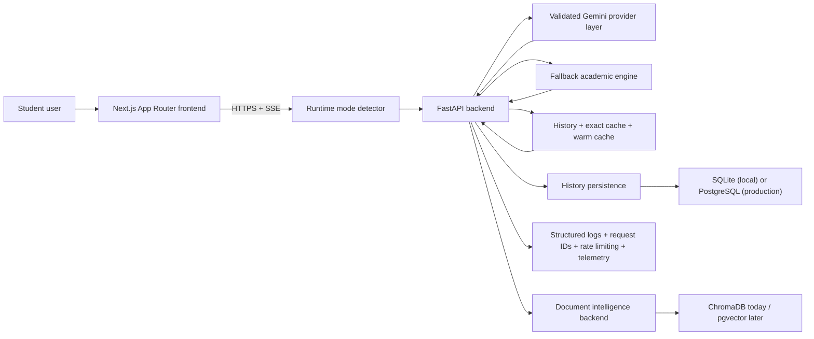
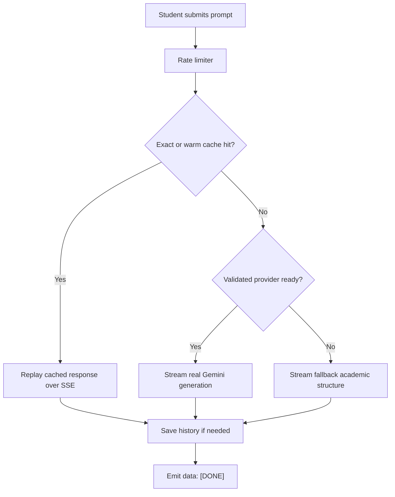
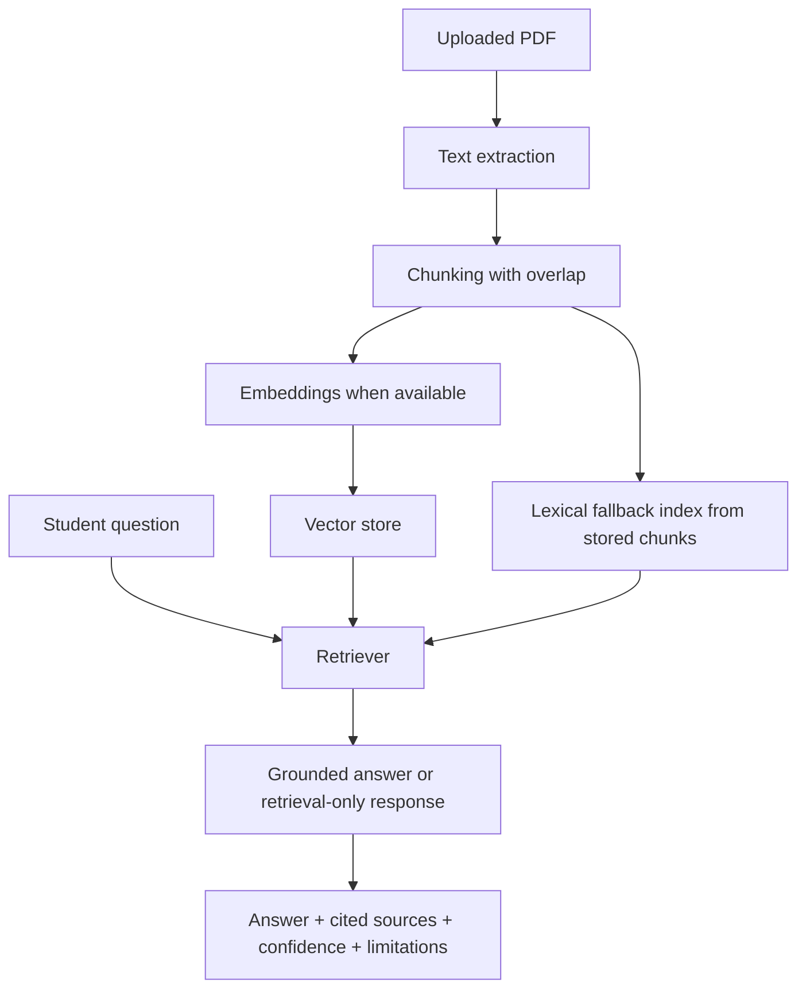
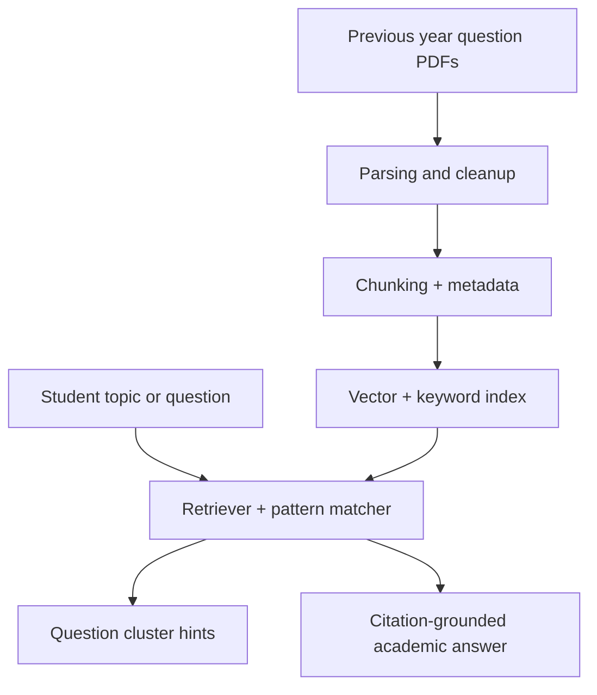

# Scholr Architecture

## Positioning

Scholr is an academic intelligence platform for BTech students. The live architecture is intentionally lean: a responsive Next.js frontend, a FastAPI backend, provider-aware SSE streaming, fallback academic generation, lightweight persistence, and a staged backend-first document intelligence layer.

## High-Level Diagram

## Live Runtime Modes

- **AI Mode**: a validated Gemini model is healthy and Scholr streams live generation
- **Cached Academic Response**: an exact or similar recent answer is replayed to protect quota and lower latency
- **Fallback Academic Mode**: the provider is degraded, but Scholr still streams deterministic academic guidance
- **Provider Recovering**: the frontend remains useful while background re-validation tries to restore AI Mode
- **Document Retrieval Mode**: document answers explicitly report whether they came from lexical, semantic, or future hybrid retrieval

## Frontend Responsibilities

- collect prompts for Research, Notes, and Doubt
- collect PDF uploads and document-grounded study questions
- call the backend using `NEXT_PUBLIC_API_URL`
- parse SSE chunks safely across desktop and mobile browsers
- expose copy, clear, retry, and mode-badge feedback
- render optimistic loading, cache hydration, and fallback scaffolds so the UI never feels stalled

## Backend Responsibilities

- assign request IDs and structured logs
- protect Gemini quota with rate limiting
- validate provider capability before promoting a model
- stream JSON-safe SSE output
- replay exact and warm-cache responses
- save history without blocking the response path
- keep fallback academic output available when the provider is degraded
- surface retrieval mode, citations, confidence, and limitations for document answers

## Current Request Lifecycle

## Reliability Layers

- validated provider-state cache with lower-cost rechecks
- cooldown-aware retry jitter and background recovery
- Fallback Academic Mode
- Cached Academic Response mode
- no-empty-output guarantee
- request IDs and categorized provider errors
- exact and warm-cache replay
- history-save isolation so successful responses are not lost
- mobile-safe stream parsing and runtime mode badges

## Provider Recovery Strategy

- strict priority chain for model validation
- real generation probe before a model becomes active
- degraded mode remains student-safe while background recovery keeps retrying
- cooldown prevents wasteful repeated probes during quota exhaustion
- `/health/provider` and `/health/generate-test` expose safe diagnostics without leaking secrets

## Data Layer

- SQLite by default for local development
- PostgreSQL in production through `DATABASE_URL`
- history stores completed responses for replay and review
- document assets and chunks are persisted for backend-first PDF intelligence
- vector storage is local today and intentionally gitignored
- `/health/documents` exposes PDF, multipart, vector, and embedding readiness without exposing secrets
- `/health/documents` truthfully reports whether live document retrieval is currently defaulting to lexical or semantic mode

## Document Intelligence Flow

## Future PYQ Intelligence Extension

This remains a planning lane, not a live student-facing feature yet.

## Deployment

- Frontend: Vercel
- Backend: Render
- Live frontend: `https://scholr-coral.vercel.app`
- Live backend health: `https://scholr-k9sj.onrender.com/health`
- Live provider health: `https://scholr-k9sj.onrender.com/health/provider`
