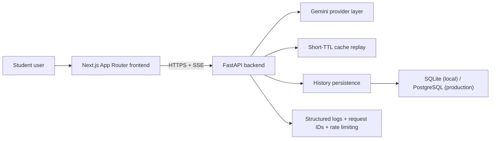

# Scholr Architecture

## Positioning

Scholr is an AI-powered academic intelligence and research assistance platform for BTech students. The architecture is intentionally simple: a responsive Next.js frontend, a FastAPI backend, Gemini generation, streaming responses, and lightweight persistence for history.

## High-Level Diagram

## Frontend

- Next.js App Router with TypeScript and Tailwind CSS
- Shared AI module page for Research, Notes, and Doubt
- Shared API client for streamed backend calls
- Env-gated analytics wrapper for safe product telemetry
- Responsive dashboard shell for mobile, tablet, laptop, and desktop

### Frontend responsibilities

- collect the user prompt
- call the backend using `NEXT_PUBLIC_API_URL`
- parse SSE chunks safely
- render loading, retry, empty, and error states
- expose copy / clear / retry actions

## Backend

- FastAPI app in `backend/main.py`
- Shared Gemini generation helper
- Shared SSE response helper
- Shared runtime helpers for rate limiting, request IDs, and logging

### API surface

- `GET /health`
- `POST /api/research`
- `POST /api/notes`
- `POST /api/doubt`
- `GET /api/history`

## Generation Flow

1. Frontend sends a module request to the FastAPI backend.
2. Backend assigns a request ID and logs `request_started`.
3. Rate limiter checks whether the client has exceeded the current MVP quota.
4. Backend checks recent history for a short-TTL cache hit.
5. If cached content exists, Scholr replays it as streamed SSE chunks.
6. Otherwise the Gemini helper selects the current validated model and begins streaming.
7. Shared SSE helper emits JSON-safe chunks and always finishes with `data: [DONE]`.
8. Completed output is saved to history if persistence is available.

## Reliability Layers

- startup provider validation
- runtime model fallback
- request IDs for debugging
- categorized provider errors
- short-TTL cache replay
- history-save isolation so generation success is not lost
- mobile-safe frontend stream parsing

## Data Layer

- SQLite by default for local development
- PostgreSQL in production through `DATABASE_URL`
- history stores completed responses so users can review recent outputs

## Deployment

- Frontend: Vercel
- Backend: Render
- Current live URLs:
  - Frontend: `https://scholr-coral.vercel.app`
  - Backend health: `https://scholr-k9sj.onrender.com/health`

