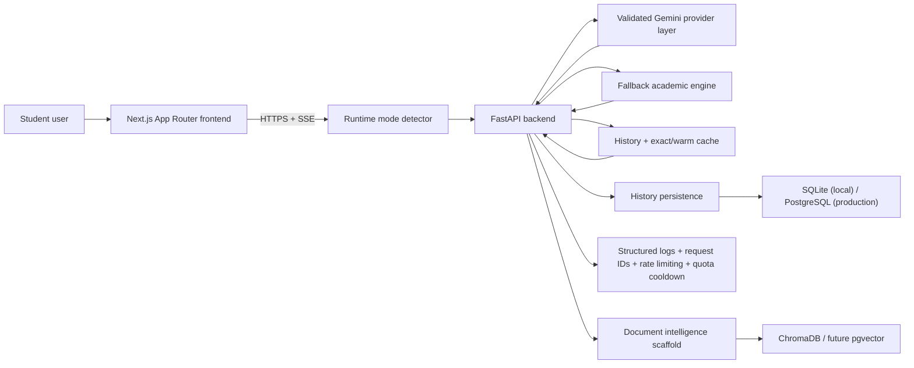
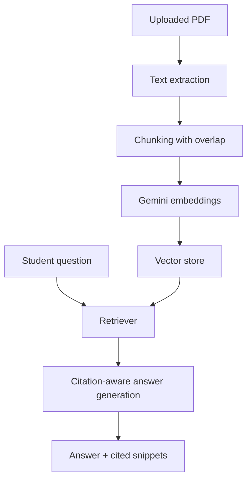

# Scholr Architecture

## Positioning

Scholr is an AI-powered academic intelligence and research assistance platform for BTech students. The architecture is intentionally simple: a responsive Next.js frontend, a FastAPI backend, Gemini generation, streaming responses, and lightweight persistence for history.

## High-Level Diagram

## Live Runtime Modes

- **AI Mode**: a validated Gemini model is healthy and Scholr streams live generation
- **Cached Academic Response**: an exact or similar recent answer is replayed to protect quota and keep latency low
- **Fallback Academic Mode**: the provider is degraded, but Scholr still streams deterministic academic guidance instead of surfacing a broken UI

## Frontend

- Next.js App Router with TypeScript and Tailwind CSS
- Shared AI module page for Research, Notes, and Doubt
- Shared API client for streamed backend calls
- Env-gated analytics wrapper for safe product telemetry
- Responsive dashboard shell for mobile, tablet, laptop, and desktop

### Frontend responsibilities

- collect the user prompt
- call the backend using `NEXT_PUBLIC_API_URL`
- parse SSE chunks safely
- render loading, retry, empty, and error states
- expose copy / clear / retry actions

## Backend

- FastAPI app in `backend/main.py`
- Shared Gemini generation helper
- Shared SSE response helper
- Shared runtime helpers for rate limiting, request IDs, and logging

### API surface

- `GET /health`
- `POST /api/research`
- `POST /api/notes`
- `POST /api/doubt`
- `GET /api/history`
- `POST /api/documents/upload`
- `POST /api/documents/answer`

## Generation Flow

1. Frontend sends a module request to the FastAPI backend.
2. Backend assigns a request ID and logs `request_started`.
3. Rate limiter checks whether the client has exceeded the current MVP quota.
4. Backend checks recent history for an exact or warm-cache match.
5. If cached content exists, Scholr replays it as streamed SSE chunks and marks the response as `Cached Academic Response`.
6. Otherwise the provider layer checks whether a validated Gemini model is currently healthy.
7. If Gemini is healthy, Scholr streams normal AI output in `AI Mode`.
8. If Gemini is quota-blocked, unavailable, or unvalidated, Scholr switches to the fallback academic engine and still streams structured guidance.
9. Shared SSE helper emits JSON-safe chunks and always finishes with `data: [DONE]`.
10. Completed output is saved to history if persistence is available.

## Reliability Layers

- startup provider validation
- strict validated-model selection and runtime fallback
- Fallback Academic Mode
- Cached Academic Response mode
- no-empty-output guarantee
- request IDs for debugging
- categorized provider errors
- exact + warm-cache replay
- quota observability and cooldown behavior
- history-save isolation so generation success is not lost
- mobile-safe frontend stream parsing

## Data Layer

- SQLite by default for local development
- PostgreSQL in production through `DATABASE_URL`
- history stores completed responses so users can review recent outputs
- document assets and chunks are scaffolded for future PDF intelligence

## Future RAG Layer

## Deployment

- Frontend: Vercel
- Backend: Render
- Current live URLs:
  - Frontend: `https://scholr-coral.vercel.app`
  - Backend health: `https://scholr-k9sj.onrender.com/health`

