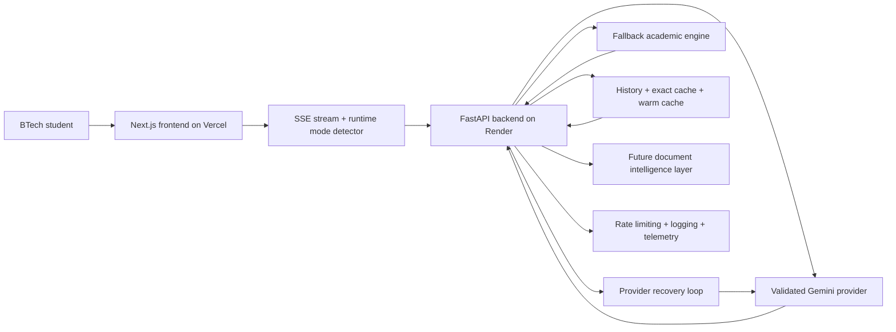

# Scholr

Scholr is an AI-powered academic intelligence platform for BTech students, combining streaming generation, provider resilience, and future retrieval-grounded document intelligence.

[](https://github.com/tauqxxr7/scholr/actions/workflows/backend-ci.yml)
[](https://github.com/tauqxxr7/scholr/actions/workflows/frontend-ci.yml)
[](https://scholr-coral.vercel.app)
[](https://scholr-k9sj.onrender.com/health)


Live links:
- Frontend: [https://scholr-coral.vercel.app](https://scholr-coral.vercel.app)
- Backend health: [https://scholr-k9sj.onrender.com/health](https://scholr-k9sj.onrender.com/health)
- Provider health: [https://scholr-k9sj.onrender.com/health/provider](https://scholr-k9sj.onrender.com/health/provider)
- Generation smoke test: [https://scholr-k9sj.onrender.com/health/generate-test](https://scholr-k9sj.onrender.com/health/generate-test)
- Document health: [https://scholr-k9sj.onrender.com/health/documents](https://scholr-k9sj.onrender.com/health/documents)


## What Scholr Is

Scholr is a live academic AI product for BTech students who need:
- research direction for projects and papers
- clean revision notes for exams and viva
- structured doubt solving without generic chatbot drift

### Core modules

- `Research`: turns a topic into papers, subtopics, and project-worthy direction
- `Notes`: turns a syllabus topic into revision-ready structure
- `Doubt`: turns a confusing concept into step-by-step explanation
- `Documents`: turns uploaded PDFs into citation-grounded academic workflows

## Demo And Proof

### Hero screenshot


### Demo video and proof

The walkthrough assets live here:
- demo placeholder: [docs/demo/demo.gif](docs/demo/demo.gif)
- optimized iOS demo clip: [docs/demo/ios-response.mp4](docs/demo/ios-response.mp4)
- script: [DEMO_SCRIPT.md](DEMO_SCRIPT.md)
- asset notes: [docs/demo/README.md](docs/demo/README.md)

### Mobile demo section

- iOS/mobile is currently the strongest public proof path
- the committed clip at [docs/demo/ios-response.mp4](docs/demo/ios-response.mp4) shows real response flow
- the raw source stays outside Git; the repo keeps an optimized demo asset only

### Desktop proof


### Mobile proof

Live product has been manually verified on iOS Safari and responsive Android-style breakpoints.


### iOS verification

- landing page verified on iPhone Safari
- Notes and Doubt flows verified on iOS/mobile
- Fallback Academic Mode verified on mobile
- Provider Recovering UX verified on mobile
- optimized proof clip is committed at [docs/demo/ios-response.mp4](docs/demo/ios-response.mp4)

## Current Production Behavior

- Frontend is live on Vercel
- Backend is live on Render
- SSE streaming is active
- mobile and desktop flows are stable
- Gemini provider can still become quota or model-access degraded
- user-facing output remains functional through AI mode, cached replay, or fallback academic mode

### Current live status

| Area | Status | Evidence |
| --- | --- | --- |
| Deployment | Live | Vercel + Render |
| Mobile responsiveness | Verified | iOS and responsive breakpoints checked |
| SSE streaming | Working | Research / Notes / Doubt stream output |
| Provider recovery | Active | `/health/provider` diagnostics |
| Fallback mode | Working | useful academic output during provider degradation |
| Cache / fallback behavior | Working | cached and recovery modes exposed to UI |
| Document intelligence | Working in retrieval-first mode | upload, citations, and retrieval-only answers live |
| User testing status | Ready | templates and validation plan included |

### Restore true AI Mode

Scholr currently preserves user-facing quality through cache, fallback, and provider recovery. To restore persistent `AI Mode` on live traffic:

1. verify the Render `GEMINI_API_KEY` belongs to a project with healthy Gemini API quota
2. confirm the project exposes at least one validated generation model from Scholr's priority chain
3. check [provider health](https://scholr-k9sj.onrender.com/health/provider) for:
   - `provider_ready`
   - `provider_error_category`
   - `validated_models_count`
   - `quota_failure_count`
   - `provider_recovery_state`
4. check [generation smoke test](https://scholr-k9sj.onrender.com/health/generate-test) for real tiny generation success
5. redeploy Render after key or quota changes

Until that recovers, the live system remains useful through `Fallback Academic Mode`, `Provider Recovering`, and `Cached Academic Response`.

## Why Scholr Is Not Just ChatGPT

Scholr is narrower, more deliberate, and more product-shaped than a generic AI chat box.

- structured academic workflows instead of blank-chat prompting
- notes tuned for revision and exam prep
- research tuned for papers, reading order, and project direction
- doubt solving tuned for concept clarification and stepwise explanation
- saved history, runtime modes, cache, and fallback behavior that preserve usefulness when providers wobble
- future PDF and PYQ intelligence planned as a grounded academic layer, not random feature bloat

## Fallback Academic Mode

Fallback Academic Mode exists so students still get useful academic help even when the provider is rate-limited, quota-degraded, or temporarily unavailable.

What it means in practice:
- no empty panels
- no raw provider errors shown to students
- deterministic academic scaffolds continue streaming through SSE
- cache can replay recent successful responses while provider recovery runs in the background

Runtime modes:
- `AI Mode`: healthy validated generation path
- `Cached Academic Response`: recent reusable answer replayed
- `Fallback Academic Mode`: deterministic academic scaffolding
- `Provider Recovering`: fallback output while provider re-validation happens in the background

## Document Intelligence

Scholr now exposes a frontend-first document workflow on top of the backend RAG foundation:

- upload a PDF
- wait for `Document Ready` or `Retrieval-only mode`
- ask grounded questions about the uploaded file
- see citation snippets with page references when available
- use academic workflows like revision notes, viva questions, and important-question extraction

This is intentionally honest:
- if embeddings or provider-backed synthesis are unavailable, Scholr does not pretend semantic AI is active
- retrieval-first answers stay useful through lexical fallback and citations

### Retrieval modes

- `Lexical Retrieval`: chunk matching from stored document text when vector search is unavailable
- `Semantic Retrieval`: embedding-backed chunk retrieval when vector search and provider health are available
- `Hybrid Retrieval`: planned next stage once the vector path is stabilized

### Citation example

`According to academic-sample, Page 1, chunk 0, DBMS normalization reduces redundancy and improves data integrity.`

## Production Resilience

- provider diagnostics through `/health/provider`
- tiny generation smoke test through `/health/generate-test`
- document health through `/health/documents`
- strict model validation before provider promotion
- cooldown-aware recovery loop
- structured logging and request IDs
- rate limiting on AI endpoints
- exact and warm-cache replay paths
- no-empty-output guarantee for Research, Notes, and Doubt
- mobile-safe fallback rendering and optimistic skeleton states
- retrieval-first document answers when semantic generation is unavailable

## Engineering Tradeoffs

- fallback-first reliability wins over blank-screen failure
- provider cooldown and recovery reduce wasteful quota probes
- exact cache and warm cache reduce repeated provider load
- no-empty-output guarantee protects the student experience during provider outages
- auth and payments remain intentionally deferred until retention and academic usefulness are proven

## Architecture Snapshot



Core docs:
- [ARCHITECTURE.md](ARCHITECTURE.md)
- [SYSTEM_DESIGN.md](SYSTEM_DESIGN.md)
- [REQUEST_FLOW.md](REQUEST_FLOW.md)
- [ENGINEERING_DECISIONS.md](ENGINEERING_DECISIONS.md)
- [DEPLOYMENT.md](DEPLOYMENT.md)

## Tech Stack

- Frontend: Next.js App Router, React, TypeScript, Tailwind CSS
- Backend: FastAPI, Python, SQLAlchemy
- AI provider layer: Google GenAI SDK with validated model selection, provider recovery, and diagnostics
- Local DB: SQLite
- Production DB path: PostgreSQL through `DATABASE_URL`
- Hosting: Vercel frontend + Render backend

## Production Evidence

See:
- [PRODUCTION_EVIDENCE.md](PRODUCTION_EVIDENCE.md)
- [METRICS.md](METRICS.md)

## How To Run Locally

### Backend

```powershell
cd backend
venv\Scripts\activate
python -m pip install -r requirements.txt
python -m uvicorn main:app --reload --port 8000
```

### Frontend

```powershell
cd frontend
npm install
npm run dev
```

Environment examples:
- [backend/.env.example](backend/.env.example)
- [frontend/.env.example](frontend/.env.example)

## Deployment

### Frontend

- Platform: Vercel
- Root Directory: `frontend`
- Env: `NEXT_PUBLIC_API_URL=https://scholr-k9sj.onrender.com`

### Backend

- Platform: Render
- Root Directory: leave empty
- Build Command: `cd backend && pip install -r requirements.txt`
- Start Command: `cd backend && uvicorn main:app --host 0.0.0.0 --port $PORT`
- `PYTHON_VERSION=3.12.4`

Detailed runbook:
- [DEPLOY_CHECKLIST.md](DEPLOY_CHECKLIST.md)
- [render.yaml](render.yaml)

## User Validation

The next milestone is not random feature growth. It is 10 to 15 student validation with real usage.

Validation assets:
- [USER_VALIDATION_PLAN.md](USER_VALIDATION_PLAN.md)
- [USER_TEST_RESULTS.md](USER_TEST_RESULTS.md)
- [FEEDBACK_FORM.md](FEEDBACK_FORM.md)
- [METRICS.md](METRICS.md)
- [docs/research/student-validation-report.md](docs/research/student-validation-report.md)

## Document Intelligence Foundation

Scholr now includes a frontend-first document workflow on top of a backend-first document intelligence foundation.

See:
- [RAG_ROADMAP.md](RAG_ROADMAP.md)
- [DOCUMENT_INTELLIGENCE.md](DOCUMENT_INTELLIGENCE.md)

Backend validation assets:
- [backend/scripts/test_documents.py](backend/scripts/test_documents.py)
- [backend/tests/fixtures/academic-sample.pdf](backend/tests/fixtures/academic-sample.pdf)

## Legal And Ownership

- [LICENSE](LICENSE)
- [TERMS.md](TERMS.md)
- [PRIVACY.md](PRIVACY.md)
- [DISCLAIMER.md](DISCLAIMER.md)

Scholr is owned by Tauqeer Bharde.  
Copyright (c) 2026 Tauqeer Bharde. All rights reserved.

## Built By Tauqeer Bharde

Tauqeer Bharde is a BTech AI and Data Science student building practical AI systems around academic intelligence, productivity, and applied ML.

- GitHub: [https://github.com/tauqxxr7](https://github.com/tauqxxr7)
- LinkedIn: [https://www.linkedin.com/in/tauqeer-sameer-85b868235](https://www.linkedin.com/in/tauqeer-sameer-85b868235)
- Email: [tauqeerplayer@gmail.com](mailto:tauqeerplayer@gmail.com)

## Roadmap

### Next

1. complete 10 to 15 student validation
2. measure retention, usefulness, and fallback-mode perception
3. restore fully healthy provider generation once quota and model access stabilize
4. validate the document intelligence backend with real PDFs before adding the frontend upload experience
5. capture more polished mobile and provider-health proof assets as the live system evolves

### Later

- PDF upload frontend once backend document intelligence is fully exercised
- PYQ intelligence and question-cluster retrieval after the core document pipeline is stable
- semantic search over history and uploaded documents
- pgvector-backed document and history retrieval
- auth and user-specific history
- Azure scaling path after demand is proven

## Lessons Learned

- resilient GenAI systems need graceful degraded-mode UX, not just better prompts
- provider orchestration matters as much as model choice in production
- mobile-first AI UI needs visible activity, not just background correctness
- academic products earn trust through structure, recoverability, and honest limitations

## Supporting Docs

- [BLUEPRINT.md](BLUEPRINT.md)
- [PROJECT_PROGRESS.md](PROJECT_PROGRESS.md)
- [docs/demo/README.md](docs/demo/README.md)
- [docs/screenshots/desktop/README.md](docs/screenshots/desktop/README.md)
- [docs/screenshots/mobile/README.md](docs/screenshots/mobile/README.md)

## Security And Hygiene

Never commit:
- `.env`
- `.env.local`
- `*.db`
- `venv`
- `.next`
- `node_modules`
- `__pycache__`
- provider keys or secrets

Scholr(TM) is an academic AI platform created by Tauqeer Bharde.
