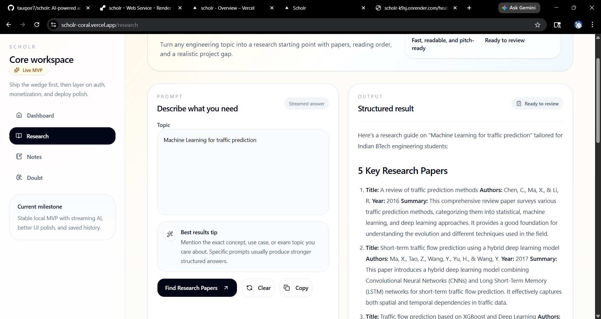
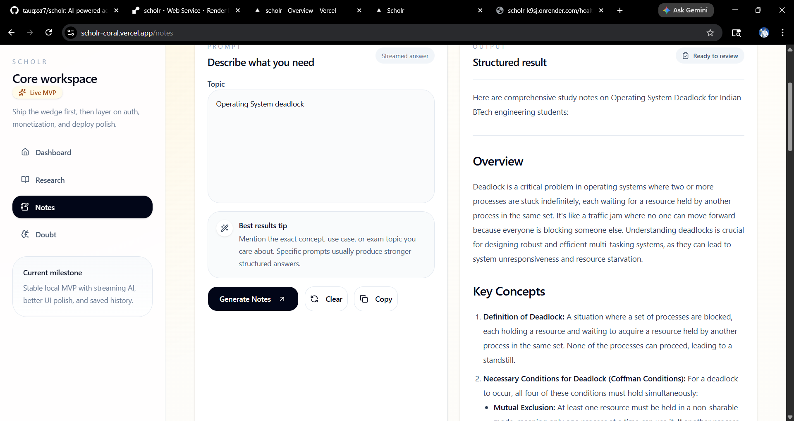

# Scholr

Scholr is an AI academic platform for BTech students. The MVP focuses on one clean promise: turn any engineering topic into research guidance, exam-ready notes, and step-by-step doubt solving in under a minute.

## Product Overview

Scholr is designed around the real workflow of engineering students:
- figure out what to study
- turn a topic into useful notes
- unblock confusing concepts quickly
- keep a history of what was generated

The product deliberately avoids unnecessary MVP complexity:
- no auth
- no Clerk
- no extra modules yet
- one stable flow first

## Features

- Research Assistant
- Notes Generator
- Doubt Solver
- Dashboard with recent history
- SSE streaming responses
- Retry, empty, loading, and error states
- Local SQLite development storage
- PostgreSQL-ready production storage through `DATABASE_URL`
- Public Privacy and Terms pages for MVP launch readiness

## Architecture

```text
scholr/
  backend/
    agents/
    db/
    models/
    routers/
    main.py
    Procfile
    runtime.txt
  frontend/
    app/
    components/
    lib/
    public/
  README.md
  PROJECT_PROGRESS.md
  DEPLOY_CHECKLIST.md
  BLUEPRINT.md
```

### Backend

- FastAPI
- Gemini API
- shared generation helper
- shared SSE helper
- SQLite locally
- PostgreSQL in production

### Frontend

- Next.js App Router
- TypeScript
- Tailwind CSS
- shared module UI
- shared API client
- markdown rendering for streamed AI output

## Tech Stack

- Frontend: Next.js, React, TypeScript, Tailwind CSS
- Backend: FastAPI, Python, SQLAlchemy
- AI: Gemini `gemini-2.5-flash`
- Local DB: SQLite
- Production DB: PostgreSQL through `DATABASE_URL`
- Frontend deploy: Vercel
- Backend deploy: Render

## Environment Variables

### Backend

Create `backend/.env` from [backend/.env.example](/C:/Users/TAUQEER%20BHARDE/.codex/worktrees/944e/scholr/backend/.env.example):

```env
GEMINI_API_KEY=your_real_key_here
DATABASE_URL=sqlite:///./scholr.db
FRONTEND_URL=http://localhost:3000
ALLOWED_ORIGINS=http://localhost:3000,http://127.0.0.1:3000
ALLOWED_ORIGIN_REGEX=https://.*\.vercel\.app
```

### Frontend

Create `frontend/.env.local` from [frontend/.env.example](/C:/Users/TAUQEER%20BHARDE/.codex/worktrees/944e/scholr/frontend/.env.example):

```env
NEXT_PUBLIC_API_URL=http://127.0.0.1:8000
```

## Local Setup

### Backend

From `backend`:

```powershell
venv\Scripts\activate
python -m pip install -r requirements.txt
python -m uvicorn main:app --reload --port 8000
```

Backend checks:
- `http://127.0.0.1:8000/health`
- `http://127.0.0.1:8000/docs`

### Frontend

From `frontend`:

```powershell
npm install
npm run dev
```

Frontend URL:
- `http://localhost:3000`

## Deployment Setup

### Render backend

Recommended manual fallback if Render root-directory detection is awkward:
- Root Directory: leave empty
- Build Command: `cd backend && pip install -r requirements.txt`
- Start Command: `cd backend && uvicorn main:app --host 0.0.0.0 --port $PORT`
- `PYTHON_VERSION=3.12.4`

Blueprint option:
- Use the root-level [render.yaml](/C:/Users/TAUQEER%20BHARDE/.codex/worktrees/944e/scholr/render.yaml)
- It defines the backend with the same safe `cd backend && ...` commands

Required env vars:

```env
GEMINI_API_KEY=your_real_key_here
DATABASE_URL=your_postgres_connection_string
FRONTEND_URL=https://your-vercel-project.vercel.app
ALLOWED_ORIGINS=https://your-vercel-project.vercel.app
ALLOWED_ORIGIN_REGEX=https://.*\.vercel\.app
```

### Vercel frontend

- Root Directory: `frontend`

Required env var:

```env
NEXT_PUBLIC_API_URL=https://your-render-backend-url.onrender.com
```

Vercel env changes require a redeploy.

## Live Demo

- Frontend: [scholr-coral.vercel.app](https://scholr-coral.vercel.app)
- Backend health: [scholr-k9sj.onrender.com/health](https://scholr-k9sj.onrender.com/health)

## Screenshots

### Landing Page


### Research Workspace


### Research Output



### Notes Output



### Doubt Output


## Current Status

Live MVP deployed on Vercel + Render.

The core flow of Research, Notes, Doubt, SSE streaming, and dashboard history is working in production.

## Roadmap

Near-term:
- run the first student validation sprint
- add CI and branch protection checks
- improve reliability and observability from real usage
- refine launch copy, SEO, and legal polish as the public rollout expands

Later:
- auth
- per-user history
- exports
- placement and project modules

## Supporting Docs

- [Blueprint](/C:/Users/TAUQEER%20BHARDE/.codex/worktrees/944e/scholr/BLUEPRINT.md)
- [Project Progress](/C:/Users/TAUQEER%20BHARDE/.codex/worktrees/944e/scholr/PROJECT_PROGRESS.md)
- [Deployment Checklist](/C:/Users/TAUQEER%20BHARDE/.codex/worktrees/944e/scholr/DEPLOY_CHECKLIST.md)

## Security Notes

Never commit:
- `.env`
- `.env.local`
- `*.db`
- `venv`
- `.next`
- `node_modules`
- `__pycache__`
- API keys

## Deployment Notes

- Frontend runs on Vercel.
- Backend runs on Render.
- Render free web services may cold start after inactivity, so the first request can take longer during demos.
