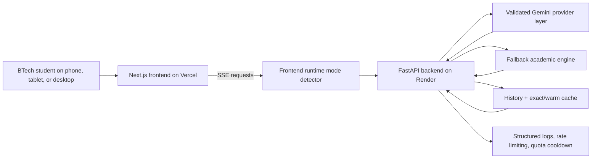

# Scholr

AI-powered academic intelligence and research assistance platform for BTech students.

[](https://scholr-coral.vercel.app)
[](https://scholr-k9sj.onrender.com/health)


## One-Glance Overview

**What it is:** Scholr is a live AI academic product for engineering students.  
**Who it is for:** BTech students who need research help, revision notes, and doubt solving without switching across scattered tools.  
**Why it matters:** Generic AI tools answer questions, but they do not package academic help in a fast, exam-friendly, research-aware workflow.

### Core modules

- **Research**: papers, reading order, and project-worthy gaps
- **Notes**: revision-ready notes structured for exam prep
- **Doubt**: step-by-step explanations with examples and simple language

## Demo Preview

`screenshots/scholr-demo.gif` is still pending from this environment, so the repo uses the screenshot walkthrough below for now.

Live product:
- Frontend: [https://scholr-coral.vercel.app](https://scholr-coral.vercel.app)
- Backend health: [https://scholr-k9sj.onrender.com/health](https://scholr-k9sj.onrender.com/health)
- Provider health: [https://scholr-k9sj.onrender.com/health/provider](https://scholr-k9sj.onrender.com/health/provider)

## 🎥 Demo Walkthrough

A short walkthrough demo is being prepared to show the core student workflow:
Dashboard → AI module → response generation → learning history.

- Expected file: `docs/demo/scholr-walkthrough.gif`
- Recording script: [docs/demo/DEMO_SCRIPT.md](docs/demo/DEMO_SCRIPT.md)
- Demo notes: [docs/demo/README.md](docs/demo/README.md)

## Screenshots

### Desktop proof

These screenshots are from the current live MVP and show the main desktop workspace flow.

### Landing Page


### Research Workspace


### Research Output


### Notes Output


### Doubt Output


### Mobile / iOS verification

- Live product has been manually verified on iPhone/iOS Safari
- Responsive workspace navigation works
- Fallback Academic Mode streams correctly on mobile
- Dedicated mobile screenshots are the next proof asset to capture for the repo package

## Production Status

**Live MVP deployed on Vercel + Render.**

Current production state:
- **Live MVP: stable**
- **Gemini provider: degraded due to quota/model access**
- **User-facing output: still functional through Fallback Academic Mode**
- frontend loads
- backend `/health` works
- Research / Notes / Doubt stream useful academic output during Gemini quota exhaustion

Render note:
- the backend runs on the Render free tier, so the first request after inactivity may cold start and take longer

## Current Live Status

- Frontend live: [https://scholr-coral.vercel.app](https://scholr-coral.vercel.app)
- Backend live: [https://scholr-k9sj.onrender.com/health](https://scholr-k9sj.onrender.com/health)
- Provider health: [https://scholr-k9sj.onrender.com/health/provider](https://scholr-k9sj.onrender.com/health/provider)
- Gemini provider currently degraded due to quota/model access
- User-facing experience remains functional through Fallback Academic Mode and Cached Academic Response mode

## Problem Scholr Solves

BTech students regularly face three repeated problems:
- research discovery is slow and fragmented
- turning a topic into useful notes is repetitive
- doubt solving is often generic, unstructured, or buried in long videos and forums

Scholr compresses those tasks into one focused product loop instead of trying to become a massive education platform too early.

## Why Scholr Is Not Just ChatGPT

Scholr is intentionally narrower and more product-shaped than a generic chatbot:

- **Structured academic workflows** instead of one blank chat box
- **Exam-ready notes** instead of free-form summaries
- **Research direction** with reading order and gap framing
- **Saved history** so outputs stay useful after one session
- **BTech-focused prompting** designed around engineering coursework, viva prep, and final-year idea exploration

## How Scholr Works

1. A student opens Research, Notes, or Doubt from the shared workspace.
2. The frontend sends one structured request to FastAPI and starts listening for SSE chunks.
3. The backend applies rate limiting, cache lookup, provider validation, and runtime mode selection.
4. If Gemini is healthy, Scholr streams the answer in `AI Mode`.
5. If Gemini is unavailable, quota-limited, or unvalidated, Scholr switches to `Fallback Academic Mode` or replays a `Cached Academic Response`.
6. The final answer is saved to history and rendered in a copy-ready format for revision, viva prep, or project ideation.

## Features

- Research Assistant
- Notes Generator
- Doubt Solver
- Dashboard with recent history
- Responsive across mobile, tablet, laptop, and desktop
- Shared SSE streaming responses
- Provider diagnostics with startup validation and runtime fallback
- Document intelligence scaffold with PDF upload, chunking, retrieval, and citation-aware answer design
- Analytics wrapper ready for PostHog when env vars are present
- In-memory IP rate limiting on AI endpoints
- Structured backend logging and request IDs
- Short-TTL response caching for repeated prompts
- Warm-cache replay for similar prompts during degraded provider periods
- Fallback Academic Mode during quota exhaustion or provider unavailability
- Cached Academic Response mode for recently reusable answers
- No-empty-output guarantee for Research, Notes, and Doubt
- Retry, loading, empty, and error states
- PWA-lite manifest for installable browser support
- SQLite locally
- PostgreSQL-ready through `DATABASE_URL`
- Public privacy and terms pages

## Current Product Depth

Scholr already goes beyond a thin AI wrapper in a few important ways:

- **SSE streaming** so answers arrive progressively instead of waiting for one large blob
- **JSON-safe AI chunks** so streamed responses are easier to parse and render reliably
- **Structured prompts** for Research, Notes, and Doubt instead of one generic prompt
- **Dashboard history** for recent academic output review
- **Render + Vercel deployment** with documented production environment handling
- **Error states** for backend issues, empty responses, and retry scenarios
- **Copy / clear / retry UI** that makes the modules usable like product surfaces, not demos
- **Analytics readiness** through an env-gated PostHog wrapper that tracks only safe product events
- **API protection** through lightweight rate limiting, request IDs, and structured logs
- **Short-TTL cache replay** for repeated prompts so quota is protected without changing the SSE UX
- **Provider resilience** through startup validation, strict validated-model orchestration, quota observability, and cooldown behavior
- **Fallback Academic Mode** so students still receive structured study guidance during provider quota exhaustion
- **Cached Academic Response mode** so recent successful answers can be reused without spending more quota
- **No-empty-output guarantee** so the core student modules never collapse into blank panels
- **RAG foundation** through isolated document routes, chunk metadata, and retrieval-ready vector storage scaffolding
- **Responsive workspace shell** so the same product loop works across phones, tablets, laptops, and desktops
- **PWA-lite support** with a manifest, theme color, and mobile-ready metadata
- **Production env handling** that keeps localhost fallback in development and requires a real API URL in production

## Fallback Academic Mode

Fallback Academic Mode exists so Scholr keeps helping students even when the Gemini provider is quota-degraded or temporarily unavailable.

What it does:
- returns structured academic scaffolding instead of a broken panel
- preserves the same SSE streaming experience
- keeps Research, Notes, and Doubt usable on desktop and mobile
- positions resilience as product quality, not as a silent failure

What students see:
- `AI Mode` when a validated Gemini model is healthy
- `Cached Academic Response` when a recent good answer can be replayed
- `Fallback Academic Mode` when live generation is unavailable but Scholr still provides useful learning structure

Why it matters:
- students still get key concepts, outlines, search directions, and revision structure
- reviewers can see Scholr behaving like a reliable academic platform rather than a brittle AI wrapper

## Production Resilience

- **Provider health endpoint** via [https://scholr-k9sj.onrender.com/health/provider](https://scholr-k9sj.onrender.com/health/provider)
- **Validated model selection** instead of trusting discovered model names blindly
- **Fallback academic engine** for quota exhaustion, provider 5xx conditions, and missing validated models
- **Quota observability** through `quota_failure_count`, `last_successful_generation_timestamp`, and `provider_recovery_state`
- **SSE recovery** so students do not get empty panels or raw provider failures
- **Warm cache layer** so similar recent prompts can still return useful academic output without spending fresh quota

## Device Support

- Mobile: 320px, 375px, and 430px layouts stack cleanly and use a drawer-style workspace nav
- Tablet: 768px keeps the mobile header/drawer pattern so content gets the full screen width
- Laptop and desktop: 1024px and 1440px keep the persistent sidebar and two-column workspaces
- Long AI output stays readable without forcing full-page horizontal scroll

## Tech Stack

- Frontend: Next.js App Router, React, TypeScript, Tailwind CSS
- Backend: FastAPI, Python, SQLAlchemy
- AI: Google GenAI Python SDK (`google-genai`) with startup discovery, automatic model selection, and fallback
- Local DB: SQLite
- Production DB: PostgreSQL through `DATABASE_URL`
- Hosting: Vercel + Render

## Architecture

```text
scholr/
  backend/
    agents/
    db/
    models/
    routers/
    main.py
    Procfile
    runtime.txt
  frontend/
    app/
    components/
    lib/
    public/
  screenshots/
  README.md
  PROJECT_PROGRESS.md
  DEPLOY_CHECKLIST.md
  BLUEPRINT.md
  ARCHITECTURE.md
  SYSTEM_DESIGN.md
  ENGINEERING_DECISIONS.md
  DEPLOYMENT.md
  render.yaml
```



### Backend

- FastAPI app with shared Gemini generation helper
- shared SSE response helper
- `GET /health`
- `POST /api/research`
- `POST /api/notes`
- `POST /api/doubt`
- `GET /api/history`
- `POST /api/documents/upload`
- `POST /api/documents/answer`

### Frontend

- shared AI module page for Research, Notes, and Doubt
- shared API client
- responsive dashboard shell
- markdown-safe output rendering

## Run Locally

### Backend

```powershell
cd backend
venv\Scripts\activate
python -m pip install -r requirements.txt
python -m uvicorn main:app --reload --port 8000
```

Create `backend/.env` from `backend/.env.example`:

```env
GEMINI_API_KEY=your_real_key_here
DATABASE_URL=sqlite:///./scholr.db
FRONTEND_URL=http://localhost:3000
ALLOWED_ORIGINS=http://localhost:3000,http://127.0.0.1:3000
ALLOWED_ORIGIN_REGEX=https://.*\.vercel\.app
```

### Frontend

```powershell
cd frontend
npm install
npm run dev
```

Create `frontend/.env.local` from `frontend/.env.example`:

```env
NEXT_PUBLIC_API_URL=http://127.0.0.1:8000
```

## Deployment

### Frontend

- Platform: Vercel
- Root Directory: `frontend`
- Required env var:

```env
NEXT_PUBLIC_API_URL=https://scholr-k9sj.onrender.com
```

### Backend

- Platform: Render
- Root Directory: leave empty
- Build Command: `cd backend && pip install -r requirements.txt`
- Start Command: `cd backend && uvicorn main:app --host 0.0.0.0 --port $PORT`
- `PYTHON_VERSION=3.12.4`

Required env vars:

```env
GEMINI_API_KEY=your_real_key_here
DATABASE_URL=your_postgres_connection_string
FRONTEND_URL=https://scholr-coral.vercel.app
ALLOWED_ORIGINS=https://scholr-coral.vercel.app
ALLOWED_ORIGIN_REGEX=https://.*\.vercel\.app
```

Alternative:
- a root-level `render.yaml` is included for Blueprint-based deployment

## Provider Troubleshooting

If Scholr shows `AI provider error. Please retry.` in production, check these in order:

1. `GEMINI_API_KEY`
   - confirm the key exists in Render backend environment variables
   - confirm it belongs to the intended Google AI project
2. Quota and API access
   - confirm the project still has quota and Gemini API access
   - check whether the project is hitting provider-side or free-tier limits
3. Model availability
   - verify `selected_model`, `available_models_count`, `candidate_models_count`, `rejected_models_count`, `validated_models_count`, `failed_validation_models_count`, and `model_selection_strategy` from `/health/provider`
   - if `provider_error_category` becomes `no_supported_generation_model` or `no_validated_generation_model`, the discovered models did not pass Scholr's production-safe generation filter
   - confirm the project exposes `gemini-1.5-flash` or `gemini-1.5-pro` (including versioned aliases) with `generateContent` capability
4. Quota resilience
   - verify `quota_failure_count`, `last_successful_generation_timestamp`, and `provider_recovery_state`
   - during quota exhaustion, Scholr should still stream `Fallback Academic Mode` or `Cached Academic Response`
5. Render redeploy state
   - after changing env vars or backend code, force a redeploy on Render
   - verify `/health` reflects the newest provider diagnostics after rollout
6. Backend smoke test
   - run `python backend/scripts/test_provider.py` with the backend env loaded
   - check `provider_status`, `selected_model`, `available_models_count`, `candidate_models_count`, `validated_models_count`, `provider_recovery_state`, and `provider_error_category`

## Roadmap

### Next

1. User validation with 10 BTech students
2. Demo video plus a polished `screenshots/scholr-demo.gif`
3. CI checks for lint, typecheck, backend validation, and build
4. Review early product signal from real student usage

### Future Auth & Security

- Google OAuth login
- user-specific history
- email verification
- password reset only if password auth is added
- rate limiting
- protected dashboard
- role-based access later

### Later

- semantic search / RAG for deeper academic retrieval
- PDF upload and document intelligence with citations from uploaded files
- PDF export and shareable study outputs
- referral loop if user validation shows organic interest
- stronger production persistence with PostgreSQL
- placements and project workflows

## Azure Future Scaling

Tauqeer has Azure for Startups access with `$1,000` in credits, but the current MVP stays on **Render + Vercel** until user validation proves real demand.

If Scholr earns that signal, the most natural Azure path is:

- Azure App Service or Azure Container Apps for the backend
- Azure Database for PostgreSQL for durable production history
- Azure AI Search for semantic history, retrieval, and future RAG workflows
- Azure Blob Storage for exports and uploaded files
- Azure Monitor / Application Insights for observability
- Azure OpenAI / Azure AI Foundry as a future managed model layer

## Built by Tauqeer Bharde

Tauqeer Bharde is a **BTech AI & Data Science student** building practical AI products around academic workflows, decision support, and developer systems learning.

Links:
- GitHub: [tauqxxr7](https://github.com/tauqxxr7)
- LinkedIn: [Tauqeer Bharde](https://www.linkedin.com/in/tauqeer-sameer-85b868235)
- Email: [tauqeerplayer@gmail.com](mailto:tauqeerplayer@gmail.com)

Project ecosystem:
- **Scholr**: flagship academic AI platform for research, notes, and doubt solving
- **AI Career Copilot**: career guidance and planning assistant
- **QueuePulse**: systems/backend learning project
- **CrisisMind Lite**: safety and impact-focused AI concept
- **CKD Hyperparameter Optimization Study**: ML experimentation and research work
- **Mini Search Engine**: information retrieval and search fundamentals
- **AI Mock Interview Coach**, **PolicyPilot Agent**, and **Customer Churn Prediction System** as adjacent AI/product exploration work

## Suggested GitHub Topics

`ai`, `genai`, `nextjs`, `fastapi`, `gemini-api`, `typescript`, `python`, `tailwindcss`, `student-productivity`, `btech`

## Supporting Docs

- [Blueprint](BLUEPRINT.md)
- [Project Progress](PROJECT_PROGRESS.md)
- [Deployment Checklist](DEPLOY_CHECKLIST.md)
- [User Validation Plan](USER_VALIDATION_PLAN.md)
- [Architecture](ARCHITECTURE.md)
- [System Design](SYSTEM_DESIGN.md)
- [Request Flow](REQUEST_FLOW.md)
- [Engineering Decisions](ENGINEERING_DECISIONS.md)
- [Deployment Guide](DEPLOYMENT.md)
- [Screenshots Notes](screenshots/README.md)

## Security Notes

Never commit:
- `.env`
- `.env.local`
- `*.db`
- `venv`
- `.next`
- `node_modules`
- `__pycache__`
- API keys
