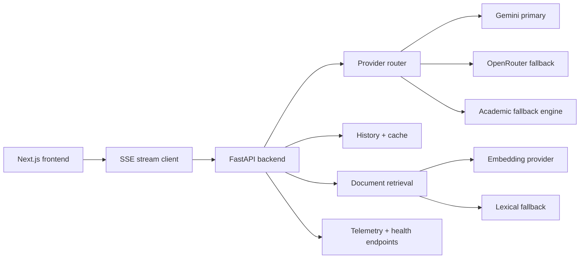
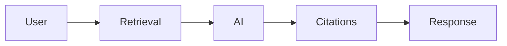

<div align="center">

# Scholr

Free AI study tool for BTech engineering students: research papers, exam notes, doubt solving, and retrieval-grounded PDF intelligence.

[Live product](https://scholr-coral.vercel.app) |
[Backend health](https://scholr-k9sj.onrender.com/health) |
[Provider health](https://scholr-k9sj.onrender.com/health/provider) |
[Generate test](https://scholr-k9sj.onrender.com/health/generate-test)

[](https://github.com/tauqxxr7/scholr/actions/workflows/backend-ci.yml)
[](https://github.com/tauqxxr7/scholr/actions/workflows/frontend-ci.yml)
[](https://scholr-coral.vercel.app)
[](https://scholr-k9sj.onrender.com/health)

**Topics:** `ai` `edtech` `fastapi` `nextjs` `btechstudents` `india` `gemini` `openrouter` `academic` `studytool` `researchassistant` `machinelearning`

</div>


## Why Scholr

BTech students often lose hours turning scattered lectures, PDFs, and web searches into usable exam notes or project research direction. Generic chatbots help, but they are not shaped around academic workflows, citations, fast revision, or degraded-mode reliability.

Scholr is a production AI study workspace that gives students structured academic outputs quickly: research direction, compact notes, step-by-step doubt solving, and grounded PDF answers with citations. It is public-access, mobile-ready, SSE-streamed, and built with provider failover so students do not hit a blank screen when an AI provider degrades.

## Key Features

- **Research:** turns a topic into short paper/resource suggestions, project relevance, reading order, and research gaps.
- **Notes:** generates compact, high-yield revision notes with predictable exam-focused sections.
- **Doubt:** answers engineering concepts with a direct explanation, steps, example, and common mistake.
- **PDF Intelligence:** supports upload, retrieval, citation snippets, semantic retrieval when healthy, and lexical fallback when embeddings degrade.
- **Resilience:** Gemini -> OpenRouter -> academic fallback engine keeps the product useful during quota or provider failures.
- **Feedback and observability:** response feedback, PostHog events, Sentry hooks, structured stream logs, and health endpoints are wired for production triage.

Optional demo asset:
- [docs/demo/demo.gif](docs/demo/demo.gif) can be replaced with a short 10-20 second Research -> Notes -> Doubt walkthrough.

All supporting screenshots and proof assets live under [docs/screenshots](docs/screenshots/) and [docs/proof](docs/proof/). The README intentionally keeps only one desktop screenshot so technical content stays above the fold.

## Architecture



## Workflow



## Tech Stack

| Layer | Stack |
| --- | --- |
| Frontend | Next.js App Router, React, TypeScript, Tailwind CSS |
| Backend | FastAPI, Python, SQLAlchemy, SSE streaming |
| AI | Gemini primary, OpenRouter fallback, deterministic academic fallback |
| Retrieval | PDF parsing, semantic retrieval, lexical fallback, citation metadata |
| Persistence | SQLite local, PostgreSQL-ready via `DATABASE_URL`, pgvector roadmap |
| Observability | PostHog, Sentry, structured logs, health endpoints, response feedback |
| Deployment | Vercel frontend, Render backend, GitHub Actions CI |

## Performance Metrics

| Metric | Current production proof |
| --- | --- |
| First token latency | Research `6967 ms`, Notes `7995 ms`, Doubt `5965 ms` from latest recorded proof |
| Completion latency | Research `7198 ms`, Notes `8015 ms`, Doubt `6225 ms` |
| SSE streaming | Research, Notes, and Doubt verified with `[DONE]` completion integrity |
| Fallback recovery | Gemini can degrade; OpenRouter is validated as live failover, academic fallback remains final safety layer |
| Document retrieval | Semantic retrieval supported; lexical fallback preserved for grounded citation answers |
| Backend tests | 35 passing in the latest local verification pass |

More evidence:
- [METRICS.md](METRICS.md)
- [docs/PRODUCTION_EVIDENCE.md](docs/PRODUCTION_EVIDENCE.md)
- [docs/proof/research-sample.md](docs/proof/research-sample.md)
- [docs/proof/notes-sample.md](docs/proof/notes-sample.md)
- [docs/proof/doubt-sample.md](docs/proof/doubt-sample.md)

## Local Setup

```bash
# Terminal 1 - backend
cd backend
pip install -r requirements.txt
cp .env.example .env
uvicorn main:app --reload --port 8000

# Terminal 2 - frontend
cd frontend
npm install
cp .env.example .env.local
npm run dev
```

Open [http://localhost:3000](http://localhost:3000).

Useful env vars:
- `NEXT_PUBLIC_API_URL=http://localhost:8000`
- `OPENROUTER_API_KEY=...`
- `GEMINI_API_KEY` for Gemini provider access
- `DATABASE_URL=...` for PostgreSQL
- `SQLITE_PATH=/data/scholr.db` for Render persistent disk fallback

## Production Deployment

Frontend:
- Platform: Vercel
- Root directory: `frontend`
- Public API env: `NEXT_PUBLIC_API_URL=https://scholr-k9sj.onrender.com`

Backend:
- Platform: Render
- Build command: `cd backend && pip install -r requirements.txt`
- Start command: `cd backend && uvicorn main:app --host 0.0.0.0 --port $PORT`
- Health check: `/health`
- Uptime ping: `/ping`

Production endpoints:
- [Health](https://scholr-k9sj.onrender.com/health)
- [Routes](https://scholr-k9sj.onrender.com/health/routes)
- [Provider](https://scholr-k9sj.onrender.com/health/provider)
- [Documents](https://scholr-k9sj.onrender.com/health/documents)
- [Generate test](https://scholr-k9sj.onrender.com/health/generate-test)
- [Evidence](https://scholr-k9sj.onrender.com/api/evidence)

Deployment docs:
- [DEPLOYMENT.md](DEPLOYMENT.md)
- [render.yaml](render.yaml)
- [docs/DEPLOY_CHECKLIST.md](docs/DEPLOY_CHECKLIST.md)

## Future Roadmap

- Complete 10-15 student validation with real BTech users.
- Move production persistence to PostgreSQL and pgvector.
- Stabilize semantic document retrieval for larger engineering PDFs and PYQ sets.
- Add syllabus-aware and semester-aware generation.
- Add saved study sessions and student history once auth is reintroduced safely.
- Add Azure OpenAI and Azure Cognitive Search as future provider/retrieval layers.
- Build PYQ extraction, marks-weightage revision, and citation confidence scoring.

## Project Docs

- [docs/ARCHITECTURE.md](docs/ARCHITECTURE.md)
- [docs/SYSTEM_DESIGN.md](docs/SYSTEM_DESIGN.md)
- [docs/DOCUMENT_INTELLIGENCE.md](docs/DOCUMENT_INTELLIGENCE.md)
- [docs/RAG_ROADMAP.md](docs/RAG_ROADMAP.md)
- [docs/MICROSOFT_APPLICATION.md](docs/MICROSOFT_APPLICATION.md)
- [docs/USER_VALIDATION_PLAN.md](docs/USER_VALIDATION_PLAN.md)
- [docs/USER_TEST_RESULTS.md](docs/USER_TEST_RESULTS.md)

## Built By

Scholr is created by Tauqeer Bharde, a BTech AI and Data Science student building practical AI systems around academic intelligence and applied ML.

- GitHub: [tauqxxr7](https://github.com/tauqxxr7)
- LinkedIn: [Tauqeer Bharde](https://www.linkedin.com/in/tauqeer-sameer-85b868235)
- Email: [tauqeerplayer@gmail.com](mailto:tauqeerplayer@gmail.com)

Scholr(TM) is an academic AI platform created by Tauqeer Bharde.
