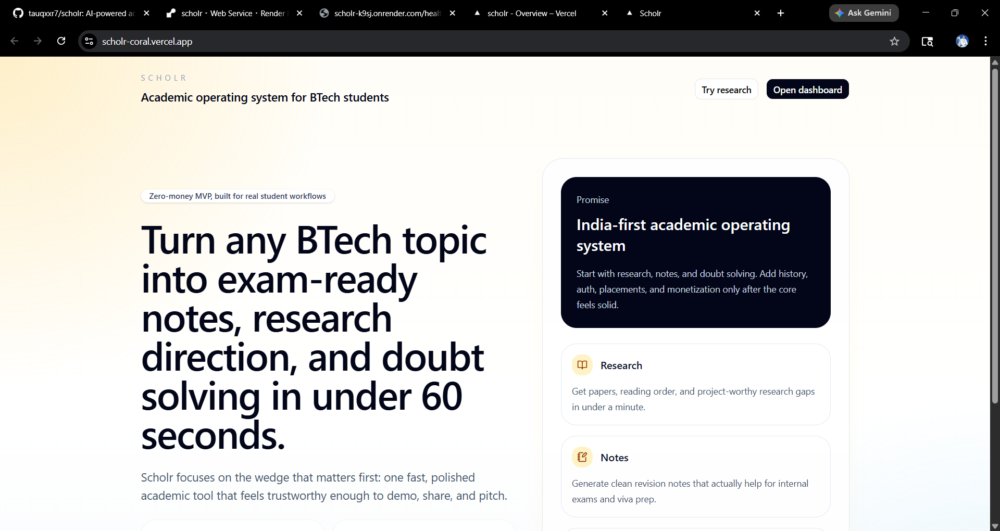
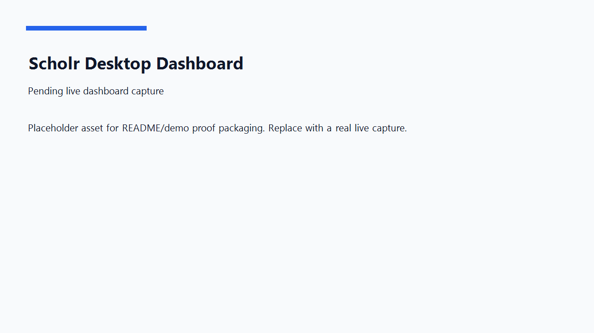
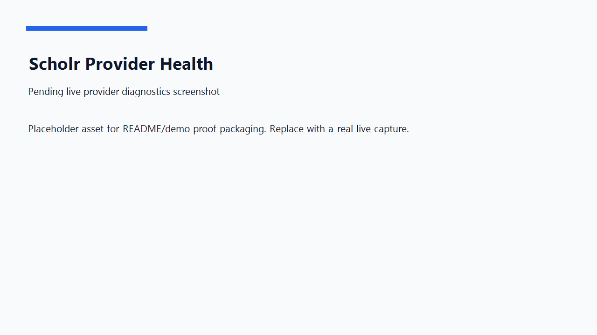
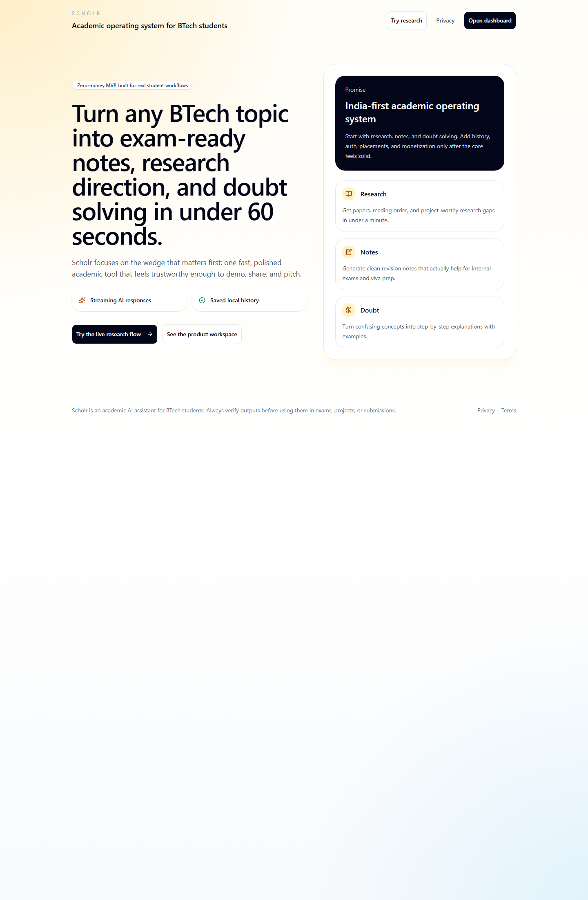
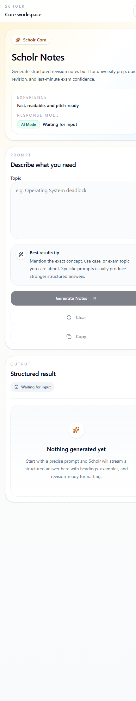
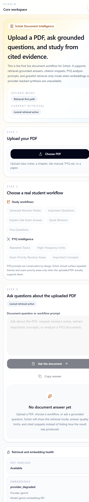
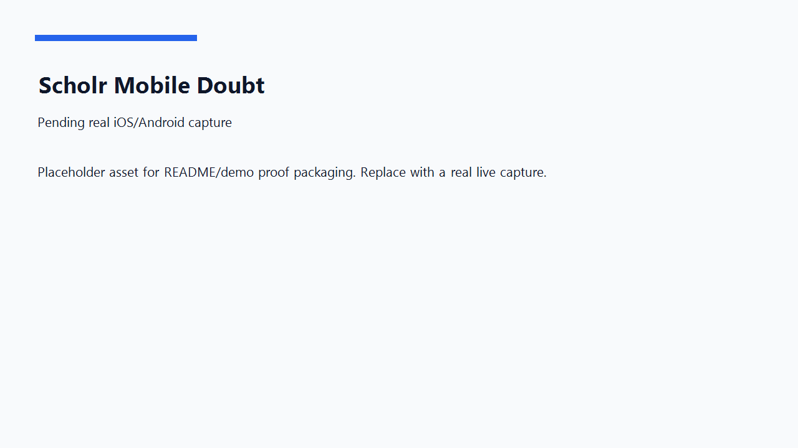
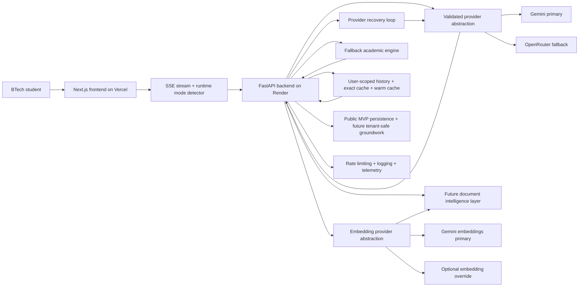

<div align="center">

# Scholr

### Free AI study tool for BTech engineering students — research papers, notes, doubt solving

**Live product** -> [scholr-coral.vercel.app](https://scholr-coral.vercel.app)

Research papers • Study notes • Doubt solving • Document intelligence

[](https://github.com/tauqxxr7/scholr/actions/workflows/backend-ci.yml)
[](https://github.com/tauqxxr7/scholr/actions/workflows/frontend-ci.yml)
[](https://scholr-coral.vercel.app)

*If Scholr helped you, please star this repo*

</div>

# Scholr

Scholr is a free AI study tool for BTech engineering students — research papers, notes, doubt solving, streaming generation, multi-provider resilience, and retrieval-grounded document intelligence.

[](https://github.com/tauqxxr7/scholr/actions/workflows/backend-ci.yml)
[](https://github.com/tauqxxr7/scholr/actions/workflows/frontend-ci.yml)
[](https://scholr-coral.vercel.app)
[](https://scholr-k9sj.onrender.com/health)


**Topics:** `ai` `edtech` `fastapi` `nextjs` `btechstudents` `india` `gemini` `openrouter` `academic` `studytool` `researchassistant` `machinelearning`

Live links:
- Frontend: [https://scholr-coral.vercel.app](https://scholr-coral.vercel.app)
- Backend health: [https://scholr-k9sj.onrender.com/health](https://scholr-k9sj.onrender.com/health)
- Provider health: [https://scholr-k9sj.onrender.com/health/provider](https://scholr-k9sj.onrender.com/health/provider)
- Generation smoke test: [https://scholr-k9sj.onrender.com/health/generate-test](https://scholr-k9sj.onrender.com/health/generate-test)
- Document health: [https://scholr-k9sj.onrender.com/health/documents](https://scholr-k9sj.onrender.com/health/documents)



## In Numbers

| Metric | Value |
|--------|-------|
| Backend tests | 28 passing |
| API endpoints | 15+ registered |
| CI pipelines | Backend + Frontend + Repo Hygiene |
| Modules | Research, Notes, Doubt, Documents |
| Deployment | Vercel (frontend) + Render (backend) |
| AI provider | OpenRouter → Gemini 2.0 Flash Lite |
| Free to use | Yes — no signup required |

## Designed for

BTech students across India studying:
- Computer Science & Engineering
- Electronics & Communication
- Information Technology
- Artificial Intelligence & Data Science
- Mechanical Engineering (core subjects)

Free. No account required. Works on mobile.

## What Scholr Is

Scholr is a live academic AI product for BTech students who need:
- research direction for projects and papers
- clean revision notes for exams and viva
- structured doubt solving without generic chatbot drift

### Core modules

- `Research`: turns a topic into papers, subtopics, and project-worthy direction
- `Notes`: turns a syllabus topic into revision-ready structure
- `Doubt`: turns a confusing concept into step-by-step explanation
- `Documents`: turns uploaded PDFs into citation-grounded academic workflows

## Demo And Proof

### Hero screenshot


### Demo video and proof

The walkthrough assets live here:
- demo placeholder: [docs/demo/demo.gif](docs/demo/demo.gif)
- optimized iOS demo clip: [docs/demo/ios-response.mp4](docs/demo/ios-response.mp4)
- script: [DEMO_SCRIPT.md](docs/DEMO_SCRIPT.md)
- asset notes: [docs/demo/README.md](docs/demo/README.md)

### Mobile demo section

- iOS/mobile is currently the strongest public proof path
- the committed clip at [docs/demo/ios-response.mp4](docs/demo/ios-response.mp4) shows real response flow
- the raw source stays outside Git; the repo keeps an optimized demo asset only

### Desktop proof





### Live production proof






Additional proof panels from live production payloads:
- [Live stream proof](docs/proof/live-stream-proof.png)
- [Provider recovery proof](docs/proof/provider-proof.png)
- [Document workflow proof](docs/proof/document-proof.png)
- [Raw live proof capture](docs/proof/live-proof.json)

Architecture GIF:
- pending real export; no fake animation is committed yet

### Mobile proof

Live product has been verified through responsive mobile viewport checks and the committed iOS demo clip. Do not treat the latest production pass as a new physical-device iPhone test unless a tester records that separately.




### iOS verification

- optimized proof clip is committed at [docs/demo/ios-response.mp4](docs/demo/ios-response.mp4)
- latest production pass used iPhone-size viewport emulation for landing, dashboard, Research, Notes, Doubt, and Documents
- physical-device iPhone retesting should be recorded in [docs/research/validation-checklist.md](docs/research/validation-checklist.md)

## Current Production Behavior

- Frontend is live on Vercel
- Backend is live on Render
- SSE streaming is active
- mobile and desktop flows are stable
- Gemini provider can still become quota or model-access degraded
- OpenRouter failover is live and currently restores true AI generation
- user-facing output remains functional through AI mode, cached replay, or fallback academic mode

## Current MVP Status

- Public-access MVP: stable across landing, dashboard, AI modules, and document workspace
- OpenRouter AI generation: active as the validated production generation provider
- Semantic retrieval: supported when the embedding provider/vector store are healthy
- Lexical fallback: preserved for grounded document answers if semantic retrieval degrades
- Auth: postponed until a custom-domain-ready auth plan is reintroduced safely
- Persistence roadmap: PostgreSQL plus pgvector is the next infrastructure step
- Student validation: pending; no student feedback or validation scores are fabricated

### Current live status

| Area | Status | Evidence |
| --- | --- | --- |
| Deployment | Live | Vercel + Render |
| Mobile responsiveness | Verified by viewport pass | iPhone/Android/tablet viewport checks; physical-device retest pending |
| SSE streaming | Working | Research / Notes / Doubt stream output |
| Provider recovery | Active | `/health/provider` diagnostics |
| Provider failover | Working | OpenRouter currently serves validated AI generation |
| Fallback mode | Working | useful academic output during provider degradation |
| Cache / fallback behavior | Working | cached and recovery modes exposed to UI |
| Document intelligence | Working in retrieval-first mode | upload, citations, and retrieval-only answers live |
| Public access | Stable | Landing, dashboard, AI modules, and documents open without sign-in |
| User testing status | Ready | templates and validation plan included |

### Final public MVP verification checklist

| Surface | Current verification status | Evidence / next proof action |
| --- | --- | --- |
| Landing page | Verified after mobile responsiveness fix | Live Vercel route and viewport checks |
| Dashboard | Verified public route | `/dashboard` opens without auth |
| Research | Verified live route and SSE stream | AI Mode stream completed with `[DONE]` |
| Notes | Verified live route and SSE stream | AI Mode stream completed with `[DONE]` |
| Doubt | Verified live route and SSE stream | AI Mode stream completed with `[DONE]` |
| Documents | Verified live route and fixture workflow | upload, answer, citation payload |
| Mobile | Verified by responsive viewport emulation | physical-device retest pending |
| Desktop | Verified by live route checks | no desktop layout regression observed |
| Provider health | Verified | `/health/provider` |
| Semantic / lexical retrieval | Supported with fallback | `/health/documents` plus document answer payload |
| SSE streaming | Verified | Research, Notes, Doubt stream integrity |

### Provider failover proof

Live provider snapshot confirmed on 2026-05-21:

- `provider_ready: true`
- `active_provider: openrouter`
- `selected_model: google/gemini-2.0-flash-lite-001`
- `selected_model_validation_status: validated`
- `provider_recovery_state: active`
- `gemini_provider_ready: false`
- `openrouter_provider_ready: true`

Real output proof:
- [docs/proof/research-sample.md](docs/proof/research-sample.md)
- [docs/proof/notes-sample.md](docs/proof/notes-sample.md)
- [docs/proof/doubt-sample.md](docs/proof/doubt-sample.md)

### Restore true AI Mode

Scholr currently preserves user-facing quality through cache, fallback, and provider recovery. To restore persistent Gemini-based `AI Mode` on live traffic:

1. verify the Render `GEMINI_API_KEY` belongs to a project with healthy Gemini API quota
2. confirm the project exposes at least one validated generation model from Scholr's priority chain
3. check [provider health](https://scholr-k9sj.onrender.com/health/provider) for:
   - `provider_ready`
   - `provider_error_category`
   - `validated_models_count`
   - `quota_failure_count`
   - `provider_recovery_state`
4. check [generation smoke test](https://scholr-k9sj.onrender.com/health/generate-test) for real tiny generation success
5. redeploy Render after key or quota changes

Until Gemini recovers, the live system remains useful through OpenRouter AI failover, `Fallback Academic Mode`, `Provider Recovering`, and `Cached Academic Response`.

## Why Scholr Is Not Just ChatGPT

Scholr is narrower, more deliberate, and more product-shaped than a generic AI chat box.

- structured academic workflows instead of blank-chat prompting
- notes tuned for revision and exam prep
- research tuned for papers, reading order, and project direction
- doubt solving tuned for concept clarification and stepwise explanation
- saved history, runtime modes, cache, and fallback behavior that preserve usefulness when providers wobble
- future PDF and PYQ intelligence planned as a grounded academic layer, not random feature bloat

## Fallback Academic Mode

Fallback Academic Mode exists so students still get useful academic help even when the provider is rate-limited, quota-degraded, or temporarily unavailable.

What it means in practice:
- no empty panels
- no raw provider errors shown to students
- deterministic academic scaffolds continue streaming through SSE
- cache can replay recent successful responses while provider recovery runs in the background

Runtime modes:
- `AI Mode`: healthy validated generation path
- `Cached Academic Response`: recent reusable answer replayed
- `Fallback Academic Mode`: deterministic academic scaffolding
- `Provider Recovering`: fallback output while provider re-validation happens in the background

## Document Intelligence

Scholr now exposes a frontend-first document workflow on top of the backend RAG foundation:

- upload a PDF
- wait for `Document Ready` or `Retrieval-only mode`
- ask grounded questions about the uploaded file
- see citation snippets with page references when available
- use academic workflows like revision notes, viva questions, and important-question extraction

This is intentionally honest:
- if embeddings or provider-backed synthesis are unavailable, Scholr does not pretend semantic AI is active
- retrieval-first answers stay useful through lexical fallback and citations
- lexical retrieval does not block grounded answer generation when the active generation provider is healthy

### Live document workflow status

- live upload is working with the bundled academic sample PDF
- live document answers return grounded citations and snippets
- live document retrieval is currently running in `Semantic Retrieval` mode
- `/health/documents` now exposes embedding provider, embedding model, embedding latency, vector-store health, and retrieval counters honestly

### Retrieval modes

- `Lexical Retrieval`: chunk matching from stored document text when vector search is unavailable
- `Semantic Retrieval`: embedding-backed chunk retrieval when vector search and embedding-provider health are available. This is the current live default.
- `Hybrid Retrieval`: planned next stage once the vector path is stabilized

### Citation example

`According to academic-sample, Page 1, chunk 0, DBMS normalization reduces redundancy and improves data integrity.`

## Production Resilience

- provider diagnostics through `/health/provider`
- tiny generation smoke test through `/health/generate-test`
- document health through `/health/documents`
- multi-provider generation priority: Gemini -> OpenRouter -> academic fallback
- separate embedding-provider abstraction: Gemini embeddings -> optional provider override -> lexical fallback
- document observability through `/health/documents`: vector-store health, embedding latency, retrieval counters, and upload/answer telemetry
- strict model validation before provider promotion
- cooldown-aware recovery loop
- structured logging and request IDs
- rate limiting on AI endpoints
- exact and warm-cache replay paths
- no-empty-output guarantee for Research, Notes, and Doubt
- mobile-safe fallback rendering and optimistic skeleton states
- retrieval-first document answers when semantic generation is unavailable, with lexical fallback preserved if the embedding path degrades later

## Engineering Tradeoffs

- fallback-first reliability wins over blank-screen failure
- provider cooldown and recovery reduce wasteful quota probes
- Gemini remains the primary provider, but OpenRouter can take over without changing frontend behavior
- exact cache and warm cache reduce repeated provider load
- no-empty-output guarantee protects the student experience during provider outages
- public-access stability wins over premature auth rollout, while billing and subscriptions remain intentionally deferred until retention and academic usefulness are proven

## Architecture Snapshot



Core docs:
- [ARCHITECTURE.md](docs/ARCHITECTURE.md)
- [SYSTEM_DESIGN.md](docs/SYSTEM_DESIGN.md)
- [REQUEST_FLOW.md](docs/REQUEST_FLOW.md)
- [ENGINEERING_DECISIONS.md](docs/ENGINEERING_DECISIONS.md)
- [DEPLOYMENT.md](DEPLOYMENT.md)

## Tech Stack

- Frontend: Next.js App Router, React, TypeScript, Tailwind CSS
- Backend: FastAPI, Python, SQLAlchemy, public request context with future tenant-safe groundwork
- AI provider layer: Google GenAI SDK for Gemini primary routing plus OpenRouter fallback support with validated model selection, provider recovery, and diagnostics
- Embedding provider layer: Gemini embeddings primary, OpenRouter-compatible embedding fallback, lexical fallback when semantic retrieval is unavailable
- Retrieval observability: `/health/documents` reports vector-store health, semantic readiness, lexical fallback readiness, retrieval counters, and latency snapshots
- Local DB: SQLite with user-scoped history, sessions, documents, and usage ledgers
- Production DB path: PostgreSQL through `DATABASE_URL`, with pgvector as the intended long-term semantic retrieval target
- Hosting: Vercel frontend + Render backend

## Production Evidence

See:
- [PRODUCTION_EVIDENCE.md](docs/PRODUCTION_EVIDENCE.md)
- [METRICS.md](METRICS.md)
- [docs/proof/research-sample.md](docs/proof/research-sample.md)
- [docs/proof/notes-sample.md](docs/proof/notes-sample.md)
- [docs/proof/doubt-sample.md](docs/proof/doubt-sample.md)
- [docs/proof/live-proof.json](docs/proof/live-proof.json)
- [docs/proof/live-stream-proof.png](docs/proof/live-stream-proof.png)
- [docs/proof/provider-proof.png](docs/proof/provider-proof.png)
- [docs/proof/document-proof.png](docs/proof/document-proof.png)

## Run locally in 60 seconds

```bash
# Terminal 1 - backend
cd backend
pip install -r requirements.txt
cp .env.example .env   # add your OPENROUTER_API_KEY
uvicorn main:app --reload --port 8000

# Terminal 2 - frontend
cd frontend
npm install
cp .env.example .env.local   # add your API URL and Clerk keys
npm run dev
```

Open http://localhost:3000

## How To Run Locally

### Backend

```powershell
cd backend
venv\Scripts\activate
python -m pip install -r requirements.txt
python -m uvicorn main:app --reload --port 8000
```

### Frontend

```powershell
cd frontend
npm install
npm run dev
```

Environment examples:
- [backend/.env.example](backend/.env.example)
- [frontend/.env.example](frontend/.env.example)

## Deployment

### Frontend

- Platform: Vercel
- Root Directory: `frontend`
- Env: `NEXT_PUBLIC_API_URL=https://scholr-k9sj.onrender.com`

### Backend

- Platform: Render
- Root Directory: leave empty
- Build Command: `cd backend && pip install -r requirements.txt`
- Start Command: `cd backend && uvicorn main:app --host 0.0.0.0 --port $PORT`
- `PYTHON_VERSION=3.12.4`
- Primary generation env: `GEMINI_API_KEY`
- Fallback generation env: `OPENROUTER_API_KEY`
- Optional embedding envs: `EMBEDDING_PROVIDER` and `EMBEDDING_MODEL`

Detailed runbook:
- [DEPLOY_CHECKLIST.md](docs/DEPLOY_CHECKLIST.md)
- [render.yaml](render.yaml)

## User Validation

The next milestone is not random feature growth. It is 10 to 15 student validation with real usage.

Validation assets:
- [USER_VALIDATION_PLAN.md](docs/USER_VALIDATION_PLAN.md)
- [USER_TEST_RESULTS.md](docs/USER_TEST_RESULTS.md)
- [FEEDBACK_FORM.md](docs/FEEDBACK_FORM.md)
- [METRICS.md](METRICS.md)
- [docs/research/student-validation-report.md](docs/research/student-validation-report.md)
- [docs/research/student-validation-report-v2.md](docs/research/student-validation-report-v2.md)
- [docs/research/validation-checklist.md](docs/research/validation-checklist.md)
- [docs/research/feedback-template.md](docs/research/feedback-template.md)

## Document Intelligence Foundation

Scholr now includes a frontend-first document workflow on top of a backend-first document intelligence foundation.

See:
- [RAG_ROADMAP.md](docs/RAG_ROADMAP.md)
- [DOCUMENT_INTELLIGENCE.md](docs/DOCUMENT_INTELLIGENCE.md)

Backend validation assets:
- [backend/scripts/test_documents.py](backend/scripts/test_documents.py)
- [backend/tests/fixtures/academic-sample.pdf](backend/tests/fixtures/academic-sample.pdf)

## Legal And Ownership

- [LICENSE](LICENSE)
- [TERMS.md](docs/TERMS.md)
- [PRIVACY.md](docs/PRIVACY.md)
- [DISCLAIMER.md](docs/DISCLAIMER.md)

Scholr is owned by Tauqeer Bharde.  
Copyright (c) 2026 Tauqeer Bharde. All rights reserved.

## Built By Tauqeer Bharde

Tauqeer Bharde is a BTech AI and Data Science student building practical AI systems around academic intelligence, productivity, and applied ML.

- GitHub: [https://github.com/tauqxxr7](https://github.com/tauqxxr7)
- LinkedIn: [https://www.linkedin.com/in/tauqeer-sameer-85b868235](https://www.linkedin.com/in/tauqeer-sameer-85b868235)
- Email: [tauqeerplayer@gmail.com](mailto:tauqeerplayer@gmail.com)

Currently applying to Microsoft for Startups. Open to feedback from engineers, founders, and students.

## Roadmap

### Next

1. complete 10 to 15 student validation
2. measure retention, usefulness, and fallback-mode perception
3. restore fully healthy provider generation once quota and model access stabilize
4. validate the live document workflow with real DBMS, OS, DSA, CN, Maths, PYQ, and research PDFs
5. capture more polished mobile and provider-health proof assets as the live system evolves
6. reintroduce multi-user auth only after PostgreSQL + persistent user storage are ready

### Later

- PYQ intelligence and question-cluster retrieval after the core document pipeline is stable
- semantic search over history and uploaded documents
- semantic retrieval stabilization through provider-backed embeddings or pgvector-backed migration
- pgvector-backed document and history retrieval
- subscription and usage-tier enforcement
- Azure scaling path after demand is proven

## Lessons Learned

- resilient GenAI systems need graceful degraded-mode UX, not just better prompts
- provider orchestration matters as much as model choice in production
- mobile-first AI UI needs visible activity, not just background correctness
- academic products earn trust through structure, recoverability, and honest limitations

## Supporting Docs

- [BLUEPRINT.md](docs/BLUEPRINT.md)
- [PROJECT_PROGRESS.md](docs/PROJECT_PROGRESS.md)
- [docs/demo/README.md](docs/demo/README.md)
- [docs/screenshots/desktop/README.md](docs/screenshots/desktop/README.md)
- [docs/screenshots/mobile/README.md](docs/screenshots/mobile/README.md)

## Security And Hygiene

Never commit:
- `.env`
- `.env.local`
- `*.db`
- `venv`
- `.next`
- `node_modules`
- `__pycache__`
- provider keys or secrets

Scholr(TM) is an academic AI platform created by Tauqeer Bharde.

