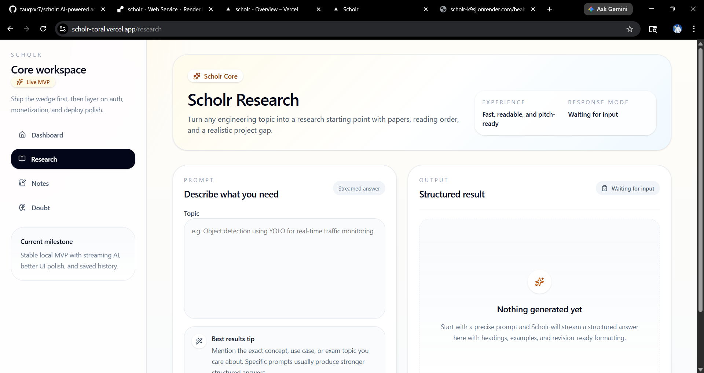
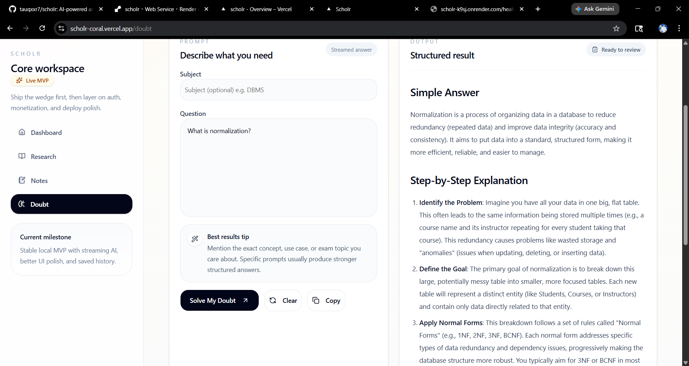

# Scholr

AI academic workspace for BTech students that turns one prompt into research direction, revision notes, and doubt solving in under a minute.

[](https://scholr-coral.vercel.app)
[](https://scholr-k9sj.onrender.com/health)


## One-Glance Overview

**What it is:** Scholr is a live AI academic product for engineering students.  
**Who it is for:** BTech students who need research help, revision notes, and doubt solving without switching across scattered tools.  
**Why it matters:** Generic AI tools answer questions, but they do not package academic help in a fast, exam-friendly, research-aware workflow.

### Core modules

- **Research**: papers, reading order, and project-worthy gaps
- **Notes**: revision-ready notes structured for exam prep
- **Doubt**: step-by-step explanations with examples and simple language

## Demo Preview

`screenshots/scholr-demo.gif` is still pending from this environment, so the repo uses the screenshot walkthrough below for now.

Live product:
- Frontend: [https://scholr-coral.vercel.app](https://scholr-coral.vercel.app)
- Backend health: [https://scholr-k9sj.onrender.com/health](https://scholr-k9sj.onrender.com/health)

## Screenshots

### Landing Page


### Research Workspace


### Research Output


### Notes Output


### Doubt Output


## Production Status

**Live MVP deployed on Vercel + Render.**

Production smoke test passed:
- landing works
- research works
- notes works
- doubt works
- backend `/health` works

Render note:
- the backend runs on the Render free tier, so the first request after inactivity may cold start and take longer

## Problem Scholr Solves

BTech students regularly face three repeated problems:
- research discovery is slow and fragmented
- turning a topic into useful notes is repetitive
- doubt solving is often generic, unstructured, or buried in long videos and forums

Scholr compresses those tasks into one focused product loop instead of trying to become a massive education platform too early.

## Why Scholr Is Not Just ChatGPT

Scholr is intentionally narrower and more product-shaped than a generic chatbot:

- **Structured academic workflows** instead of one blank chat box
- **Exam-ready notes** instead of free-form summaries
- **Research direction** with reading order and gap framing
- **Saved history** so outputs stay useful after one session
- **BTech-focused prompting** designed around engineering coursework, viva prep, and final-year idea exploration

## Features

- Research Assistant
- Notes Generator
- Doubt Solver
- Dashboard with recent history
- Shared SSE streaming responses
- Retry, loading, empty, and error states
- SQLite locally
- PostgreSQL-ready through `DATABASE_URL`
- Public privacy and terms pages

## Current Product Depth

Scholr already goes beyond a thin AI wrapper in a few important ways:

- **SSE streaming** so answers arrive progressively instead of waiting for one large blob
- **JSON-safe AI chunks** so streamed responses are easier to parse and render reliably
- **Structured prompts** for Research, Notes, and Doubt instead of one generic prompt
- **Dashboard history** for recent academic output review
- **Render + Vercel deployment** with documented production environment handling
- **Error states** for backend issues, empty responses, and retry scenarios
- **Copy / clear / retry UI** that makes the modules usable like product surfaces, not demos
- **Production env handling** that keeps localhost fallback in development and requires a real API URL in production

## Tech Stack

- Frontend: Next.js App Router, React, TypeScript, Tailwind CSS
- Backend: FastAPI, Python, SQLAlchemy
- AI: Gemini `gemini-2.5-flash`
- Local DB: SQLite
- Production DB: PostgreSQL through `DATABASE_URL`
- Hosting: Vercel + Render

## Architecture

```text
scholr/
  backend/
    agents/
    db/
    models/
    routers/
    main.py
    Procfile
    runtime.txt
  frontend/
    app/
    components/
    lib/
    public/
  screenshots/
  README.md
  PROJECT_PROGRESS.md
  DEPLOY_CHECKLIST.md
  BLUEPRINT.md
  render.yaml
```

### Backend

- FastAPI app with shared Gemini generation helper
- shared SSE response helper
- `GET /health`
- `POST /api/research`
- `POST /api/notes`
- `POST /api/doubt`
- `GET /api/history`

### Frontend

- shared AI module page for Research, Notes, and Doubt
- shared API client
- responsive dashboard shell
- markdown-safe output rendering

## Run Locally

### Backend

```powershell
cd backend
venv\Scripts\activate
python -m pip install -r requirements.txt
python -m uvicorn main:app --reload --port 8000
```

Create `backend/.env` from `backend/.env.example`:

```env
GEMINI_API_KEY=your_real_key_here
DATABASE_URL=sqlite:///./scholr.db
FRONTEND_URL=http://localhost:3000
ALLOWED_ORIGINS=http://localhost:3000,http://127.0.0.1:3000
ALLOWED_ORIGIN_REGEX=https://.*\.vercel\.app
```

### Frontend

```powershell
cd frontend
npm install
npm run dev
```

Create `frontend/.env.local` from `frontend/.env.example`:

```env
NEXT_PUBLIC_API_URL=http://127.0.0.1:8000
```

## Deployment

### Frontend

- Platform: Vercel
- Root Directory: `frontend`
- Required env var:

```env
NEXT_PUBLIC_API_URL=https://scholr-k9sj.onrender.com
```

### Backend

- Platform: Render
- Root Directory: leave empty
- Build Command: `cd backend && pip install -r requirements.txt`
- Start Command: `cd backend && uvicorn main:app --host 0.0.0.0 --port $PORT`
- `PYTHON_VERSION=3.12.4`

Required env vars:

```env
GEMINI_API_KEY=your_real_key_here
DATABASE_URL=your_postgres_connection_string
FRONTEND_URL=https://scholr-coral.vercel.app
ALLOWED_ORIGINS=https://scholr-coral.vercel.app
ALLOWED_ORIGIN_REGEX=https://.*\.vercel\.app
```

Alternative:
- a root-level `render.yaml` is included for Blueprint-based deployment

## Roadmap

### Next

1. User validation with 10 BTech students
2. Light analytics and usage instrumentation
3. Demo video plus a polished `screenshots/scholr-demo.gif`
4. CI checks for lint, typecheck, backend validation, and build

### Future Auth & Security

- Google OAuth login
- user-specific history
- email verification
- password reset only if password auth is added
- rate limiting
- protected dashboard
- role-based access later

### Later

- caching repeated prompts where it clearly improves latency
- structured backend logs and request IDs
- stronger rate limiting
- stronger production persistence with PostgreSQL
- exports
- placements and project workflows

## Built by Tauqeer Bharde

Tauqeer Bharde is a **BTech AI & Data Science student** building practical AI products around academic workflows, decision support, and developer systems learning.

Links:
- GitHub: [tauqxxr7](https://github.com/tauqxxr7)
- LinkedIn: [Tauqeer Bharde](https://www.linkedin.com/in/tauqeer-sameer-85b868235)
- Email: [tauqeerplayer@gmail.com](mailto:tauqeerplayer@gmail.com)

Project ecosystem:
- **Scholr**: flagship academic AI platform for research, notes, and doubt solving
- **AI Career Copilot**: career guidance and planning assistant
- **QueuePulse**: systems/backend learning project
- **CrisisMind Lite**: safety and impact-focused AI concept
- **CKD Hyperparameter Optimization Study**: ML experimentation and research work
- **Mini Search Engine**: information retrieval and search fundamentals
- **AI Mock Interview Coach**, **PolicyPilot Agent**, and **Customer Churn Prediction System** as adjacent AI/product exploration work

## Suggested GitHub Topics

`ai`, `genai`, `nextjs`, `fastapi`, `gemini-api`, `typescript`, `python`, `tailwindcss`, `student-productivity`, `btech`

## Supporting Docs

- [Blueprint](BLUEPRINT.md)
- [Project Progress](PROJECT_PROGRESS.md)
- [Deployment Checklist](DEPLOY_CHECKLIST.md)
- [Screenshots Notes](screenshots/README.md)

## Security Notes

Never commit:
- `.env`
- `.env.local`
- `*.db`
- `venv`
- `.next`
- `node_modules`
- `__pycache__`
- API keys
