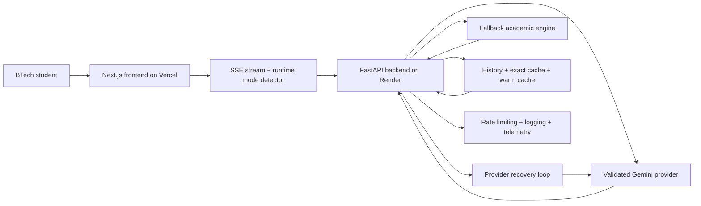

# Scholr

AI-powered academic intelligence and research assistance platform for BTech students.

[](https://github.com/tauqxxr7/scholr/actions/workflows/backend-ci.yml)
[](https://github.com/tauqxxr7/scholr/actions/workflows/frontend-ci.yml)
[](https://scholr-coral.vercel.app)
[](https://scholr-k9sj.onrender.com/health)


Live links:
- Frontend: [https://scholr-coral.vercel.app](https://scholr-coral.vercel.app)
- Backend health: [https://scholr-k9sj.onrender.com/health](https://scholr-k9sj.onrender.com/health)
- Provider health: [https://scholr-k9sj.onrender.com/health/provider](https://scholr-k9sj.onrender.com/health/provider)
- Generation smoke test: [https://scholr-k9sj.onrender.com/health/generate-test](https://scholr-k9sj.onrender.com/health/generate-test)


## What Scholr Is

Scholr is a live academic AI product built for BTech students who need:
- research direction for projects and papers
- clean revision notes for exams and viva
- structured doubt solving without generic chatbot drift

### Core modules

- `Research`: turns a topic into papers, subtopics, and project-worthy direction
- `Notes`: turns a syllabus topic into revision-ready structure
- `Doubt`: turns a confusing concept into step-by-step explanation

## Demo And Proof

### Hero screenshot


### Demo GIF

The polished walkthrough asset is being prepared here:
- [docs/demo/demo.gif](docs/demo/demo.gif)
- script: [DEMO_SCRIPT.md](DEMO_SCRIPT.md)
- iOS video slot: `docs/demo/ios-response.mp4` (not committed yet in this workspace)

### Mobile demo section

- iOS/mobile live path is currently the strongest public demo proof
- use [DEMO_SCRIPT.md](DEMO_SCRIPT.md) for the 60-90 second walkthrough
- if the `.mp4` is added later, store it as `docs/demo/ios-response.mp4`

### Desktop proof


### Mobile proof

Live product has been manually verified on iOS Safari and responsive Android-style breakpoints.


### iOS verification

- landing page verified on iPhone Safari
- Notes and Doubt flows verified on iOS/mobile
- Fallback Academic Mode verified on mobile
- Provider Recovering UX verified on mobile
- real iOS demo video is expected to live at `docs/demo/ios-response.mp4` when copied into the repo

## Current Production Behavior

- Frontend is live on Vercel
- Backend is live on Render
- SSE streaming is active
- Mobile and desktop flows are stable
- Gemini provider is currently quota/model-access degraded
- User-facing output remains functional through fallback and cache-backed resilience

### Current live status

| Area | Status | Evidence |
| --- | --- | --- |
| Deployment | Live | Vercel + Render |
| Mobile responsiveness | Verified | iOS and responsive breakpoints checked |
| SSE streaming | Working | Research / Notes / Doubt stream output |
| Provider recovery | Active | `/health/provider` diagnostics |
| Fallback mode | Working | useful academic output during provider degradation |
| Cache / fallback behavior | Working | cached and recovery modes exposed to UI |
| User testing status | Ready | templates and validation plan included |

### Restore true AI Mode

Scholr currently preserves user-facing quality through cache, fallback, and provider recovery. To restore persistent `AI Mode` on live traffic:

1. verify the Render `GEMINI_API_KEY` belongs to a project with healthy Gemini API quota
2. confirm the provider project exposes at least one validated generation model from Scholr's priority chain
3. check [provider health](https://scholr-k9sj.onrender.com/health/provider) for:
   - `provider_ready`
   - `provider_error_category`
   - `validated_models_count`
   - `quota_failure_count`
   - `provider_recovery_state`
4. check [generation smoke test](https://scholr-k9sj.onrender.com/health/generate-test) for real tiny generation success
5. redeploy Render after key or model-access changes

Until that recovers, the current live system remains useful through `Fallback Academic Mode`, `Provider Recovering`, and `Cached Academic Response`.

## Why Scholr Is Not Just ChatGPT

Scholr is narrower, more deliberate, and more product-shaped than a generic AI chat box.

- Structured academic workflows instead of blank-chat prompting
- Notes tuned for revision and exam prep
- Research tuned for papers, reading order, and project direction
- Doubt solving tuned for concept clarification and stepwise explanation
- Saved history, runtime modes, cache, and fallback behavior that preserve usefulness when providers wobble

## Fallback Academic Mode

Fallback Academic Mode exists so students still get useful academic help even when the provider is rate-limited, quota-degraded, or temporarily unavailable.

What it means in practice:
- no empty panels
- no raw provider errors shown to students
- deterministic academic scaffolds continue streaming through SSE
- cache can replay recent successful responses while provider recovery runs in the background

Runtime modes:
- `AI Mode`: healthy validated generation path
- `Cached Academic Response`: recent reusable answer replayed
- `Fallback Academic Mode`: deterministic academic scaffolding
- `Provider Recovering`: fallback output while provider re-validation happens in the background

## Production Resilience

- Provider diagnostics through `/health/provider`
- Tiny generation smoke test through `/health/generate-test`
- Strict model validation before provider promotion
- Cooldown-aware recovery loop
- Structured logging and request IDs
- Rate limiting on AI endpoints
- Exact and warm-cache replay paths
- No-empty-output guarantee for Research, Notes, and Doubt
- Mobile-safe fallback rendering and optimistic skeleton states

## Architecture Snapshot



Core docs:
- [ARCHITECTURE.md](ARCHITECTURE.md)
- [SYSTEM_DESIGN.md](SYSTEM_DESIGN.md)
- [REQUEST_FLOW.md](REQUEST_FLOW.md)
- [ENGINEERING_DECISIONS.md](ENGINEERING_DECISIONS.md)
- [DEPLOYMENT.md](DEPLOYMENT.md)

## Tech Stack

- Frontend: Next.js App Router, React, TypeScript, Tailwind CSS
- Backend: FastAPI, Python, SQLAlchemy
- AI provider layer: Google GenAI SDK with validated model selection, fallback, and diagnostics
- Local DB: SQLite
- Production DB path: PostgreSQL through `DATABASE_URL`
- Hosting: Vercel frontend + Render backend

## Production Evidence

See:
- [PRODUCTION_EVIDENCE.md](PRODUCTION_EVIDENCE.md)
- [METRICS.md](METRICS.md)

## How To Run Locally

### Backend

```powershell
cd backend
venv\Scripts\activate
python -m pip install -r requirements.txt
python -m uvicorn main:app --reload --port 8000
```

### Frontend

```powershell
cd frontend
npm install
npm run dev
```

Environment examples:
- [backend/.env.example](backend/.env.example)
- [frontend/.env.example](frontend/.env.example)

## Deployment

### Frontend

- Platform: Vercel
- Root Directory: `frontend`
- Env: `NEXT_PUBLIC_API_URL=https://scholr-k9sj.onrender.com`

### Backend

- Platform: Render
- Root Directory: leave empty
- Build Command: `cd backend && pip install -r requirements.txt`
- Start Command: `cd backend && uvicorn main:app --host 0.0.0.0 --port $PORT`
- `PYTHON_VERSION=3.12.4`

Detailed runbook:
- [DEPLOY_CHECKLIST.md](DEPLOY_CHECKLIST.md)
- [render.yaml](render.yaml)

## User Validation

The next milestone is not random feature growth. It is 10-student validation with real usage.

Validation assets:
- [USER_VALIDATION_PLAN.md](USER_VALIDATION_PLAN.md)
- [USER_TEST_RESULTS.md](USER_TEST_RESULTS.md)
- [FEEDBACK_FORM.md](FEEDBACK_FORM.md)
- [METRICS.md](METRICS.md)

## Document Intelligence Foundation

Scholr already includes a backend-only document intelligence scaffold. The frontend upload flow is intentionally not built yet so the current product remains stable.

See:
- [RAG_ROADMAP.md](RAG_ROADMAP.md)
- [DOCUMENT_INTELLIGENCE.md](DOCUMENT_INTELLIGENCE.md)

## Legal And Ownership

- [LICENSE](LICENSE)
- [TERMS.md](TERMS.md)
- [PRIVACY.md](PRIVACY.md)
- [DISCLAIMER.md](DISCLAIMER.md)

Scholr is owned by Tauqeer Bharde.  
Copyright © 2026 Tauqeer Bharde. All rights reserved.

## Built By Tauqeer Bharde

Tauqeer Bharde is a BTech AI & Data Science student building practical AI systems around academic intelligence, productivity, and applied ML.

- GitHub: [https://github.com/tauqxxr7](https://github.com/tauqxxr7)
- LinkedIn: [https://www.linkedin.com/in/tauqeer-sameer-85b868235](https://www.linkedin.com/in/tauqeer-sameer-85b868235)
- Email: [tauqeerplayer@gmail.com](mailto:tauqeerplayer@gmail.com)

## Roadmap

### Next

1. Capture a polished demo GIF and mobile proof screenshots
2. Complete 10-student validation
3. Measure retention, usefulness, and fallback-mode perception
4. Restore fully healthy provider generation once quota/model access stabilizes
5. Validate the document intelligence backend with real PDFs before adding the frontend upload experience

### Later

- PDF upload frontend once backend document intelligence is fully exercised
- PYQ intelligence and question-cluster retrieval after the core document pipeline is stable
- semantic search over history and uploaded documents
- pgvector-backed document and history retrieval
- auth and user-specific history
- Azure scaling path after demand is proven

## Supporting Docs

- [BLUEPRINT.md](BLUEPRINT.md)
- [PROJECT_PROGRESS.md](PROJECT_PROGRESS.md)
- [docs/demo/README.md](docs/demo/README.md)
- [docs/screenshots/desktop/README.md](docs/screenshots/desktop/README.md)
- [docs/screenshots/mobile/README.md](docs/screenshots/mobile/README.md)

## Security And Hygiene

Never commit:
- `.env`
- `.env.local`
- `*.db`
- `venv`
- `.next`
- `node_modules`
- `__pycache__`
- provider keys or secrets

Scholr™ is an academic AI platform created by Tauqeer Bharde.
