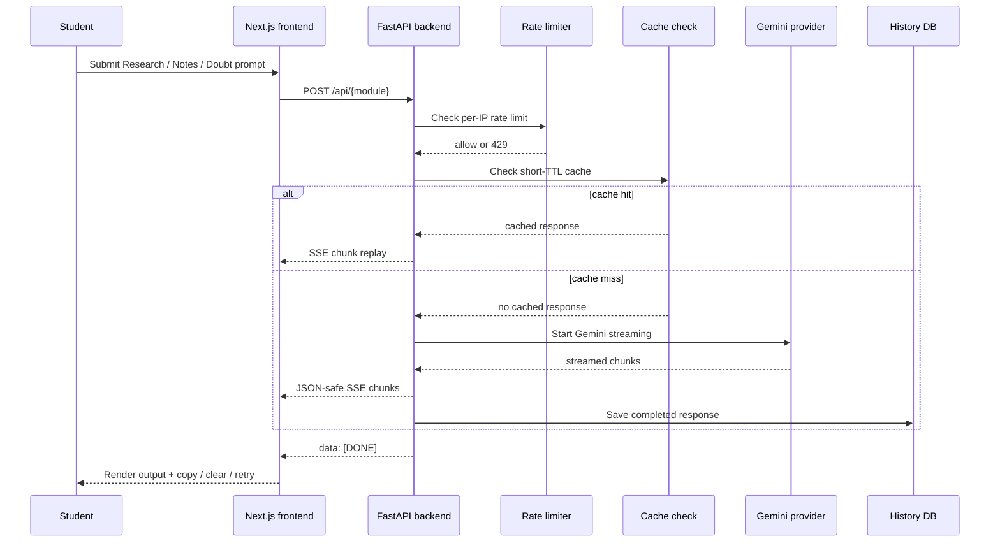
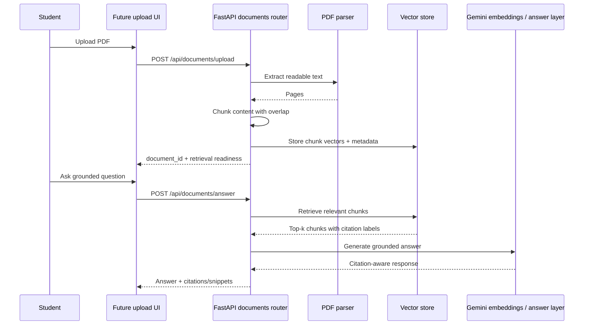

# Scholr Request Flow

## 1. Current AI Module Flow

## 2. Current Frontend Rendering Flow

1. The student opens Research, Notes, or Doubt.
2. The shared module page sends a request to the shared API client.
3. The frontend parses SSE events incrementally.
4. Output updates live while generation is still in flight.
5. If an error occurs, the page shows a category-aware retry state.

## 3. Current Reliability Controls

- request IDs on every backend request
- structured logs
- in-memory rate limiting
- short-TTL cache replay
- provider startup validation
- runtime model fallback
- history-save isolation

## 4. Document Intelligence Scaffold Flow

## 5. Why This Flow Matters

Scholr's defensibility will come from turning generic AI access into:

- repeatable academic workflows
- grounded document understanding
- citation-aware output
- reusable history and memory

That is the difference between a useful student product and a generic chat wrapper.
